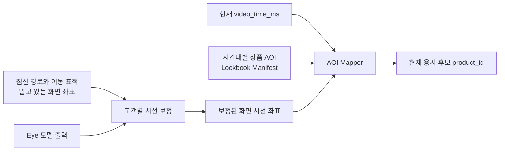

# D1 기술·운영 의사결정서

- 문서 상태: 팀장 기본안 v0.2
- 작성일: 2026-08-11
- 최근 수정: 2026-08-13 원격 Vision Inference 제안 반영
- 기준 문서: `README.md`, `docs/OVERALL_DESIGN.md`, `docs/DETAILED_DESIGN_PLAN.md`
- 목적: 팀원이 구현을 시작하기 전에 공통 실행 환경과 통합 기준을 고정한다.

이 문서의 `잠정 결정`은 별도 이견이 없으면 그대로 구현을 시작하는 기본값이다. 실제 기기, 외부 모델 또는 룩북 원본이 있어야 판단할 수 있는 값은 억지로 확정하지 않고 `검증 후 확정`으로 표시한다. 변경할 때는 결정 이유와 영향 범위를 ADR에 남긴다.

## 1. 결정 현황

| ID | 결정 항목 | 팀장 기본안 | 상태 | 최종 확인자 |
| --- | --- | --- | --- | --- |
| D1-01 | 시선 보정과 AOI | 점선 경로와 이동 표적을 이용한 보정 후 별도 검증, AOI는 영상 manifest로 사전 작성 | 방식 잠정 결정, 수치 D5 확정 | 양유상·조윤혜 |
| D1-02 | Frontend | React + TypeScript + Vite, Kiosk와 Manager를 별도 앱으로 구성 | 잠정 결정 | 조윤혜·박형진 |
| D1-03 | Python·Node와 설치 방식 | Node 24 LTS + npm, Python 3.13 + uv, AI 환경은 서비스별 분리 | 잠정 결정 | 박형진·양유상·정은미 |
| D1-04 | Kiosk 기기·브라우저·카메라 | Windows 11 + Edge Stable + 16:9 Full HD + 720p/30fps 이상 카메라를 기준 환경으로 사용 | 실제 장비 확인 필요 | 박형진·조윤혜 |
| D1-05 | Eye·Face 실행 위치 | Kiosk는 캡처·시간 동기화, 별도 Vision 서버는 Eye·Face 추론을 담당하고 원본 frame은 WSS로 일시 전송 후 비저장 | 원격 전환 방향 확인, 개인정보·network·benchmark 승인 필요 | 박형진·양유상·정은미·조윤혜 |
| D1-06 | 매니저 제품 요청 알림 | S04에서 고객이 제품 요청 버튼을 누를 때만 Top 2와 함께 `customer_product_request` 기록 | 이슈 #6, Consumer 검토 필요 | 박형진·조윤혜 |
| D1-07 | PostgreSQL과 migration | PostgreSQL 17.10 Docker Compose, SQLAlchemy 2 + Alembic, migration 단일 순서 관리 | 잠정 결정 | 박형진 |
| D1-08 | 룩북 영상과 상품 | 개발용 fixture로 병렬 개발, 실제 영상·상품은 version과 checksum을 고정한 뒤 manifest·catalog에 반영 | 실제 자산 확정 필요 | 전원 |

### 상태의 의미

- `잠정 결정`: 팀은 이 값으로 구현을 시작한다. 바꾸려면 영향받는 팀원과 합의하고 ADR을 남긴다.
- `검증 후 확정`: 인터페이스는 현재 문서대로 구현하되, 숫자·제품명·모델 runtime 등은 정해진 Gate에서 확정한다.
- `확정`: 근거와 승인자가 기록되었고 이후 변경은 별도 변경 결정이 필요하다.

---

## 2. D1-01 시선 보정과 AOI

### 먼저 구분해야 할 두 가지

시작할 때 고객이 점선을 따라 움직이는 점을 바라보게 하는 방식은 사용할 수 있다. 다만 이것은 **AOI 좌표를 맞추는 작업이 아니라 시선 보정(calibration)** 이다.

- 시선 보정: 고객의 눈 특징 또는 모델의 gaze vector를 화면의 `(x, y)` 좌표로 변환한다.
- AOI: 룩북의 특정 재생 시각에 상품이 영상의 어느 영역에 있는지를 미리 기록한 polygon이다.
- 상품 판정: 보정된 시선 좌표와 현재 영상 시각을 AOI manifest에 대입해 어떤 상품 영역을 보고 있는지 판단한다.



점선을 따라가는 화면만 만들고 실제 오차를 확인하지 않으면 보정 성공 여부를 알 수 없다. 따라서 다음과 같이 **이동 표적 + 정지 지점 + 별도 검증 지점**을 함께 사용한다.

### 팀장 기본안

1. S02 동의가 끝난 뒤 S03 재생 전에 보정 화면을 표시한다.
2. 화면의 여러 위치를 잇는 점선 위로 표적 점이 이동한다.
3. 표적은 정해진 anchor에서 잠시 멈춘다. Eye Adapter는 표적의 실제 좌표와 관측값을 짝지어 보정한다.
4. 보정에 쓰지 않은 별도 지점을 보여 주고 오차와 AOI hit 품질을 검증한다.
5. 기준을 통과하면 룩북을 재생한다. 실패하면 한 번 재시도하고, 계속 실패하면 `gaze_unavailable` 상태로 Face·fallback 흐름을 사용한다.
6. 원본 프레임은 저장하지 않는다. `calibration_id`, 모델 revision, 화면 크기, 성공 여부와 오차 요약만 파생 데이터로 남긴다.

이동 표적을 따라보는 smooth-pursuit 방식은 연구된 보정 접근이지만, 실제 웹캠·거리·조명·모델에 따라 오차가 달라진다. 따라서 anchor 개수, 이동 속도, 정지 시간, 통과 오차는 지금 임의로 고정하지 않고 동일 Kiosk 장비와 목표 Vision 서버·network 조건에서 Eye 후보를 비교한 뒤 D5에 확정한다.

### D5까지 확정할 값

| 항목 | 기록할 내용 |
| --- | --- |
| 보정 패턴 | anchor 개수와 좌표, 이동 순서, 반복 횟수 |
| 시간 | 이동 속도, anchor 정지 시간, 전체 보정 제한 시간 |
| 통과 기준 | 중앙값·상위 오차, AOI hit 정확도, valid sample 비율 |
| 실패 처리 | 재시도 횟수, gaze 미사용 fallback과 사용자 문구 |
| 재보정 | 머리 위치 변화·장시간 dropout 등 재보정 조건 |
| 접근성 | 표적 크기·색 대비, 안경·저시력 사용자의 중단 경로 |

### AOI 작성 규칙

- AOI는 `contracts/lookbook-manifest.schema.json` 형식으로 영상 제작 후 작성한다.
- 좌표는 영상 content 기준 `0.0~1.0`, 원점은 좌상단이다.
- 시간 구간은 `start_ms <= video_time_ms < end_ms`이다.
- 상품이 움직이면 시간 구간을 나눠 polygon을 여러 개 작성한다.
- 개발 overlay에서 실제 영상, 시선 점과 AOI polygon을 동시에 표시해 사람이 검수한다.
- 보정 실패나 영상 밖 좌표를 `(0, 0)`으로 바꾸지 않고 `valid=false`와 사유로 전달한다.

---

## 3. D1-02 Frontend 기술과 공통 실행 명령

### 선택지

| 선택지 | 장점 | 이 프로젝트에서의 판단 |
| --- | --- | --- |
| React + TypeScript + Vite | client 중심 SPA가 단순하고 개발 서버·빌드가 빠름 | **선택** |
| Next.js | SSR, 서버 라우팅, 웹 서비스 배포 기능이 강함 | 현재 FastAPI 중심 Kiosk에는 불필요한 책임이 늘어남 |
| Vanilla JavaScript | 초기 파일 수가 적음 | S01-S04 상태, 실시간 이벤트, 공통 타입을 관리하기 어려움 |

### 팀장 기본안

- `apps/kiosk`: React + TypeScript + Vite 기반 S01-S04 Kiosk 앱
- `apps/manager`: React + TypeScript + Vite 기반 매니저 알림 앱
- 두 앱은 root npm workspace를 사용하고 root `package-lock.json` 하나를 공유한다.
- REST·polling 데이터 타입은 `contracts/`에서 생성하거나 contract test로 검증한다.
- Kiosk 상태는 `screensaver → menu → consent → calibration → lookbook → finalizing → report`처럼 명시적인 상태 전이로 관리한다.
- 무거운 AI 모델 코드는 React component에 직접 넣지 않고 `VisionClient` 경계 뒤에 둔다.

### root에서 보장할 실행 명령

아래 명령은 Frontend scaffold PR에서 root `package.json`에 구현한다. 문서 작성 시점에는 아직 앱 실행 코드가 없으므로 **예정된 공통 계약**이다.

```powershell
npm install
npm run dev:kiosk
npm run dev:manager
npm run build
npm run test
npm run lint
```

CI와 clean install은 lock 파일을 바꾸지 않는 다음 명령을 사용한다.

```powershell
npm ci
npm run build
npm run test
```

### 완료 조건

- 새 팀원이 README와 이 문서만 보고 Kiosk와 Manager를 각각 실행할 수 있다.
- 두 앱의 개발 port와 Backend URL은 `.env.example`에만 기록하고 실제 secret은 commit하지 않는다.
- `npm run build`, `npm run test`, `npm run lint`가 CI에서 같은 방식으로 실행된다.

---

## 4. D1-03 Python·Node 버전과 패키지 설치 방식

### 팀장 기본안

| 영역 | 기준 버전 | 설치·잠금 방식 | 비고 |
| --- | --- | --- | --- |
| Frontend | Node.js `24.19.0` LTS | npm + root `package-lock.json` | `.node-version`에 고정 |
| FastAPI | Python `3.13.15` | `pyproject.toml` + uv + `uv.lock` | API 전용 환경 |
| Eye | 우선 Python `3.13.15` | Eye 전용 `pyproject.toml` + `uv.lock` | 모델 호환 실패 시 해당 서비스만 예외 |
| Face | 우선 Python `3.13.15` | Face 전용 `pyproject.toml` + `uv.lock` | 모델 호환 실패 시 해당 서비스만 예외 |
| Contract validator | Python `3.13.15` | 현재 `requirements-contracts.txt` 유지 | 앱 의존성과 분리 |

Node 24는 현재 LTS 계열이고 Vite의 최소 Node 요구사항보다 높다. Python 3.13은 현재 정기 bugfix 지원 계열이다. 단, 외부 Eye·Face 후보가 특정 Python/CUDA/ONNX 조합만 지원하면 모델 선택 ADR에 근거를 남기고 **그 AI 서비스 환경만** 다른 Python 버전으로 고정한다. API 환경까지 함께 낮추지 않는다.

### Python 환경을 나누는 이유

Eye와 Face 후보는 서로 다른 PyTorch, TensorFlow, ONNX Runtime, MediaPipe 또는 native library를 요구할 수 있다. 하나의 가상환경과 lock 파일에 모두 넣으면 한 팀원의 후보 실험이 다른 팀원의 API 실행을 깨뜨릴 수 있다.

```text
apps/api/.venv         ← FastAPI·DB
services/eye/.venv     ← Eye 후보와 Adapter
services/face/.venv    ← Face 후보와 Adapter
```

각 프로젝트는 자기 디렉터리에서 다음 공통 명령을 제공한다.

```powershell
uv sync --locked
uv run pytest
```

API 실행 예시는 scaffold가 만들어진 뒤 다음 형식으로 고정한다.

```powershell
Set-Location apps/api
uv sync --locked
uv run uvicorn app.main:app --reload
```

### 패키지 변경 규칙

- JavaScript dependency는 `npm install <package>`로 바꾸고 `package-lock.json`을 함께 commit한다.
- Python dependency는 해당 프로젝트에서 `uv add <package>`로 바꾸고 `pyproject.toml`, `uv.lock`을 함께 commit한다.
- `latest`, branch 이름 또는 고정되지 않은 Git dependency를 운영 Adapter에 사용하지 않는다.
- 외부 모델은 URL, 정확한 revision/commit, weight checksum과 code·weight license를 기록한다.
- 이미 merge된 lock 파일을 수동 편집하지 않는다.

---

## 5. D1-04 실제 Kiosk 기기·브라우저·카메라 환경

입력 품질과 전체 지연 시간은 개발자의 노트북이 아니라 **실제 시연 Kiosk·카메라·network와 목표 Vision 서버**를 함께 기준으로 판단해야 한다. 장비가 정해지기 전에는 다음 값을 Kiosk reference profile로 사용한다.

### Reference profile

| 항목 | 기본값 | 실제 장비에서 기록할 값 |
| --- | --- | --- |
| OS | Windows 11 64-bit, 최신 보안 업데이트 | edition, build |
| Browser | Microsoft Edge Stable | 정확한 version |
| 화면 | 16:9, 1920×1080, 배율 100% 권장 | 해상도, 배율, touch 여부 |
| CPU/RAM | 4 core 이상, RAM 16GB 이상을 1차 기준 | 모델명, core, RAM |
| GPU | 필수로 가정하지 않음 | GPU, VRAM, driver, 가속 API |
| Camera | 고정 설치, 1280×720 30fps 이상 요청 | 모델명, 실제 width/height/fps |
| Network | 유선 연결 우선 | server RTT·jitter·packet loss·지속 upload bandwidth |
| 배치 | 카메라를 화면 상단 중앙에 고정 | 화면과의 높이·각도 |
| 사용자 환경 | 정면 1인, 일정한 전면 조명 | 권장 거리와 조도 범위 |

해상도와 fps는 브라우저 또는 runtime에 요청하는 값일 뿐 실제 장치가 그대로 제공한다고 가정하지 않는다. 실행 시 실제 camera settings를 읽어 benchmark에 기록한다.

### Browser 운영 방식

- 개발: Edge Stable 일반 창에서 `localhost`로 실행한다.
- 시연: Windows Assigned Access 또는 Edge fullscreen kiosk mode를 사용한다.
- 카메라 접근 origin과 권한을 시연 전에 고정하고 매 세션마다 권한 팝업이 뜨지 않는지 확인한다.
- Kiosk가 원격 주소에서 열리면 HTTPS를 사용한다. `localhost` 개발 환경 외의 평문 HTTP에서 카메라가 동작할 것이라고 가정하지 않는다.
- 브라우저 자동 업데이트 직후의 예기치 않은 변화를 피하기 위해 D9 release candidate에서 정확한 Edge version으로 회귀 테스트하고 시연 장비 정보를 기록한다.

### 장비 확정 양식

```text
기기 제조사·모델:
OS edition·build:
CPU / RAM:
GPU / VRAM / driver:
화면 해상도·배율·touch:
Edge version:
카메라 제조사·모델:
실제 camera width·height·fps:
Vision server RTT·jitter·packet loss·upload bandwidth:
카메라 위치와 권장 사용자 거리:
시연 장소의 조명 조건:
확정일 / 확인자:
```

### Gate

D2 전에 Kiosk·카메라와 network 측정 조건을 기록하고, D5 모델 선정 benchmark와 D8 live test는 같은 Kiosk·목표 Vision 서버·network 조건 또는 동일 사양에서 실행한다.

---

## 6. D1-05 Eye·Face 모델 실행 위치

### 변경 배경과 상태

Eye Tracking과 표정 분석을 같은 Kiosk에서 안정적으로 실행하기 어렵다는 판단에 따라 **별도 Vision Inference 서버**로 옮기는 방향을 1차안으로 둔다. 이 변경은 원본 frame의 네트워크 전송을 새로 허용해야 하므로 바로 `확정`으로 처리하지 않는다. 상세 경계와 승인 조건은 [`ADR-0001 원격 Eye·Face 추론 서버 전환`](adr/0001-remote-vision-inference.md)을 기준으로 하며, ADR이 Accepted되기 전에는 실제 고객 frame을 원격 전송하지 않는다.

### 지금 고정하는 설계 경계

- Kiosk의 단일 `FrameSource`가 카메라를 열고 `frame_id`, 캡처 시각, `video_time_ms`, `playback_epoch`과 화면 layout을 만든다.
- 카메라는 video만 요청하고 audio capture·전송은 사용하지 않는다.
- `RemoteVisionClient`가 고객 동의가 확인된 세션에서만 binary frame과 capture context를 WSS로 전송한다.
- 일반 FastAPI Backend와 PostgreSQL은 원본 image·frame·embedding을 받거나 저장하지 않는다.
- 별도 Vision Gateway가 frame을 메모리에서 decode하고 같은 frame을 Eye·Face Worker에 fan-out한다.
- Gateway는 `GazeSample`과 `ExpressionSample`만 Kiosk에 반환하며 출력 schema와 invalid 의미는 Contract v1을 유지한다.
- 원본 frame은 proxy·Gateway·Worker·APM·로그·파일·DB·cache·backup에 남기지 않는다.
- 네트워크가 끊기거나 서버가 과부하일 때 Fake 결과를 만들지 않고 명시적인 분석 불가 상태로 종료한다.

### MVP transport

| 선택지 | 판단 | 이유와 재평가 조건 |
| --- | --- | --- |
| Binary WSS | **MVP 제안** | frame과 capture context를 한 logical message로 결합하기 쉽고 현재 브라우저·Python 경계에서 구현 범위가 작다. 자동 backpressure가 없으므로 in-flight `1`, 최신 frame 우선, message/FPS limit가 필수다. |
| WebRTC | 재평가 | media 전송과 network 적응에 유리하지만 signaling과 frame별 Kiosk metadata 결합이 복잡하다. 다중 Kiosk 또는 WSS 성능 Gate 실패 시 비교한다. |
| Kiosk-local runtime | 개발 fallback만 유지 | Fake·Replay와 제한된 로컬 후보 실험에 사용한다. 실제 고객 흐름에서 원격 실패를 가짜 로컬 결과로 대체하지 않는다. |

### D5까지 검증할 값

- 실제 server 후보에서 Eye AOI hit 품질과 calibration 성공률
- frame encode·upload·queue·Eye/Face 추론·return을 포함한 capture-to-result p50/p95
- 지속 result FPS, drop rate, 첫 결과와 warmup 시간
- server CPU/GPU/RAM/VRAM, 한 세션 모델 메모리와 10분 이상 안정성
- no-face, multi-face, 안경, 조도, 머리 움직임과 network 단절 후 회복
- 설치 재현성, 고정 revision, code·weight license와 배포 비용
- 원본 frame 비저장, 로그·APM·proxy buffer와 접근 통제 점검
- 동시 Kiosk 수와 현장 network에서 필요한 bandwidth

### runtime별 공통 계약

Frontend는 구현 위치를 직접 알지 않고 `VisionClient`만 사용한다.

```text
startSession(context)
startCalibration(pattern)
startInference()
onGazeSample(sample)
onExpressionSample(sample)
stopSession()
health()
```

어느 runtime을 선택해도 출력 schema, `video_time_ms`, 좌표 기준과 invalid reason은 바꾸지 않는다.

원격 stream의 handshake, binary envelope, 인증·만료, drop/error와 close 의미는 이 문서에서 임의로 만들지 않고 ADR 승인 후 별도 `Vision Stream v1` Contract PR에서 정의한다.

---

## 7. D1-06 매니저 제품 요청 알림 시점

### 결정

추천 결과가 완료돼도 자동 알림을 보내지 않는다. **S04에서 고객이 `매니저에게 제품 요청` 버튼을 누를 때만** Kiosk가 `POST /api/v1/sessions/{session_id}/manager-product-requests`를 호출한다.

Backend는 URL의 세션과 `recommendation_id`를 검증한 뒤, 클라이언트가 보낸 상품 목록을 신뢰하지 않고 서버의 완료된 Top 2로 `customer_product_request` 이벤트를 저장한다.

```text
S04 고객 제품 요청
  → customer_product_request
  → Manager REST polling
```

Manager Screen은 `GET /api/v1/manager/events?after_sequence={last_sequence}`을 1~2초 간격으로 조회한다. `event_id`로 중복을 제거하고 가장 큰 `sequence`를 다음 cursor로 사용한다. 양방향 채팅과 WebSocket endpoint는 MVP 범위에서 제외한다.

### ManagerEvent 최소 정보

- 공통: `schema_version`, `event_id`, `sequence`, `session_id`, `kiosk_id`, `event_type`, `emitted_at`, `payload`
- `customer_product_request`: `intent=view_recommended_products`, `recommendation_id`, `engine_mode`, rank와 `product_id`로 구성된 서버 검증 Top 2
- 상품 표시명과 이미지는 Manager가 같은 `product_id`로 catalog를 조회해 표시

알림 조회 실패가 Kiosk 룩북 재생을 막아서는 안 된다. 기존 `session_started`, `recommendation_ready`는 v1 소비자 호환을 위해 계약 enum에 남기되, 새 Producer는 생성하지 않는다.

---

## 8. D1-07 PostgreSQL 실행 환경과 migration 방식

### 팀장 기본안

- 개발·통합·시연의 PostgreSQL major는 `17`, 최초 고정 이미지는 `postgres:17.10`으로 한다.
- 개발자는 Docker Compose로 같은 DB 환경을 실행한다.
- 시연은 Vision Gateway, FastAPI와 PostgreSQL을 같은 server 또는 같은 private network에 두고 Kiosk가 하나의 HTTPS/WSS origin으로 접속한다. PostgreSQL과 Worker port는 외부에 공개하지 않는다.
- 데이터는 named volume을 사용하고, demo reset은 별도 명령으로 명시한다.
- ORM은 SQLAlchemy 2, schema migration은 Alembic을 사용한다.
- 앱 시작 시 `create_all()`로 운영 schema를 몰래 바꾸지 않는다. 항상 migration을 적용한다.

PostgreSQL 17은 공식 지원 중인 major이며 2029년까지 지원 일정이 있다. patch version은 팀이 임의로 섞지 않고 dependency update PR에서 함께 올린다.

### 예정 실행 명령

```powershell
docker compose up -d db
docker compose ps

Set-Location apps/api
uv sync --locked
uv run alembic upgrade head
uv run alembic current --check-heads
uv run uvicorn app.main:app --reload
```

현재 `compose.yaml`, API package와 Alembic 환경은 아직 구현 전이므로 위 명령은 D2 scaffold PR이 보장해야 할 계약이다.

### migration 규칙

1. migration 파일 순서는 박형진이 관리한다.
2. 한 PR은 migration 한 개를 원칙으로 하고 schema 변경과 관련 코드·테스트를 함께 설명한다.
3. 이미 `main`에 merge된 migration 파일은 수정하지 않고 새 revision을 추가한다.
4. 두 branch가 동시에 Alembic head를 만들지 않게 migration이 필요한 PR은 먼저 예약한다.
5. downgrade 가능 여부와 데이터 손실 가능성을 PR에 기록한다.
6. CI는 빈 DB에 `alembic upgrade head`를 실행하고 head 일치 여부를 검사한다.
7. 상품 seed와 schema migration을 분리한다. 실제 상품 목록 수정 때문에 migration을 만들지 않는다.

### 설정·보안

- `DATABASE_URL`은 `.env.example`에 형식만 제공하고 실제 password는 commit하지 않는다.
- PostgreSQL port를 외부 인터넷에 공개하지 않는다.
- 원본 frame, base64, image blob/path 또는 얼굴 embedding 컬럼을 만들지 않는다.
- 동의한 파생 반응, 추천, 구매 전환 데이터의 보유 기간·삭제 기준은 개인정보 상세 설계에서 별도 확정한다.

---

## 9. D1-08 실제 룩북 영상과 상품 목록

영상이 기획 중이어도 FE·AI·BE가 기다릴 필요는 없다. 개발용 fixture와 실제 자산을 분리한다.

### 단계별 자산

| 단계 | 사용할 자산 | 목적 |
| --- | --- | --- |
| D1~D3 | 현재 example manifest·catalog와 synthetic/replay fixture | 계약·화면·API 병렬 개발 |
| D4~D5 | timecode와 임시 AOI가 있는 편집본 | Eye 좌표와 상품 mapping 검증 |
| D6 이후 | checksum을 고정한 실제 룩북 master와 실제 상품 catalog | live 통합·시연 |

### 영상 확정 시 기록할 값

```text
video_id:
파일명·저장 위치:
파일 SHA256:
duration_ms:
width × height:
frame rate:
codec:
화면 표시 방식(object-fit contain/cover):
manifest_version:
자산 사용 권한 확인자:
확정일:
```

- README의 목표 경험은 약 60초이지만 실제 `duration_ms`는 최종 export 파일에서 읽어 기록한다.
- 영상 파일이 바뀌면 같은 이름으로 덮어쓰지 않고 `video_id` 또는 version과 checksum을 바꾼다.
- FE의 `video_time_ms`, AI의 AOI mapping, DB의 분석 결과는 모두 같은 `video_id`와 `manifest_version`을 사용한다.
- 영상의 crop 또는 `object-fit`을 바꾸면 좌표 mapping을 다시 검증한다.

### 상품 catalog 확정 시 기록할 값

`contracts/product-catalog.schema.json`에 따라 상품마다 다음 값을 준비한다.

| 필드 | 의미 |
| --- | --- |
| `product_id` | 영상, AOI, 추천, DB가 공유하는 변경되지 않는 ID |
| `display_name` | S04와 Manager 화면에 표시할 공식 상품명 |
| `category` | 가방·백팩·지갑 등 비교 단위 |
| `image_url` | 승인된 상품 이미지 위치 |
| `product_url` | 고객 QR이 이동할 공식 상품 페이지 |
| `qr_asset_path` | 사전 생성한 상품별 QR PNG 위치 |

첫 실제 vertical slice는 **최소 4개 상품**으로 시작한다. Top 2 외 대안이 있어야 추천 흐름을 확인할 수 있고, 초기 AOI 작성·검수 범위를 통제하기 위한 개발 기준이다. 최종 영상의 상품 수는 영상 기획에서 확정한다.

### 고정 QR에 대한 결정

상품별 QR을 미리 생성해 이미지와 함께 보여 주는 방식은 적합하다. S04 로딩이 단순하고 같은 상품은 항상 같은 공식 페이지로 이동한다. 다만 고정 QR만으로는 어느 Kiosk 세션의 스캔·구매인지 자동 연결되지 않는다.

따라서 MVP에서는 다음을 분리한다.

- QR: 상품 공식 페이지 이동
- 구매 전환: Manager 화면에서 해당 익명 `session_id`와 상품에 `착용`, `구매`, `관심 없음` 등의 결과를 별도로 기록
- POS/CRM 연동: 후속 범위

### 자산 freeze Gate

- D3: 임시 `video_id`와 최소 4개 placeholder `product_id` 고정
- D5: 편집본 timecode, 상품 노출 구간과 임시 AOI 검수
- D6: 실제 상품명·이미지·URL·QR과 룩북 checksum 고정
- D8: 실제 Kiosk에서 AOI overlay, QR scan, Top 2 표시를 함께 검증

---

## 10. 팀 회의에서 승인할 체크리스트

아래 항목을 한 번의 D1 회의에서 확인하고 이 표의 상태를 갱신한다.

- [ ] React + TypeScript + Vite와 npm workspace를 승인했다.
- [ ] Node `24.19.0`, Python `3.13.15`, uv 사용을 팀원 PC에서 확인했다.
- [ ] 실제 Kiosk 장비·Edge·카메라 정보를 기록했다.
- [ ] 원격 Vision 서버로의 일시적 frame 전송과 고객 동의 범위를 승인했다.
- [ ] WSS, server benchmark와 원본 frame 비저장 검증 Gate·담당자를 정했다.
- [ ] 최초 Manager 알림을 S02 AI 선택 + 동의 완료로 확정했다.
- [ ] PostgreSQL 17.10 Compose와 Alembic migration 규칙을 승인했다.
- [ ] 임시 video ID와 placeholder product ID 최소 4개를 정했다.
- [ ] Eye 보정 UI는 점선 이동 표적 + 별도 검증으로 구현하기로 했다.
- [ ] 보정 통과 수치는 Eye benchmark 이후 D5에 확정하기로 했다.

승인 결과는 다음처럼 기록한다.

```text
회의일:
참석자:
승인한 ID:
수정이 필요한 ID와 내용:
미결 항목의 담당자·기한:
```

## 11. 근거 자료

- [Node.js Releases](https://nodejs.org/en/about/previous-releases): LTS 사용 원칙과 현재 지원 계열
- [Vite Getting Started](https://vite.dev/guide/): React TypeScript template과 Node 요구사항
- [Python Downloads](https://www.python.org/downloads/): Python 지원 상태와 release 정보
- [uv locking and syncing](https://docs.astral.sh/uv/concepts/projects/sync/): `pyproject.toml`, `uv.lock`, `uv sync --locked`
- [PostgreSQL Versioning Policy](https://www.postgresql.org/support/versioning/): major 지원 기간과 현재 지원 version
- [Alembic Documentation](https://alembic.sqlalchemy.org/en/latest/): SQLAlchemy 기반 migration 관리
- [Docker Compose Quickstart](https://docs.docker.com/compose/gettingstarted/): 동일 개발 환경, healthcheck와 named volume 구성
- [Microsoft Edge Kiosk Mode](https://learn.microsoft.com/en-us/deployedge/microsoft-edge-configure-kiosk-mode): fullscreen Kiosk 운영 방식
- [MediaDevices.getUserMedia](https://developer.mozilla.org/en-US/docs/Web/API/MediaDevices/getUserMedia): 카메라 권한과 secure context 요구사항
- [MDN WebSocket API](https://developer.mozilla.org/en-US/docs/Web/API/WebSockets_API): binary 양방향 연결과 표준 WebSocket의 backpressure 제약
- [ADR-0001 원격 Eye·Face 추론 서버 전환](adr/0001-remote-vision-inference.md): 실행 위치 변경의 transport·개인정보·장애·배포 Gate
- [Pursuit Calibration](https://www.perceptualui.org/publications/pfeuffer13_uist.pdf): 이동 표적 기반 시선 보정 연구
- [Smooth-i](https://eprints.lancs.ac.uk/id/eprint/126771/): smooth pursuit를 이용한 시선 보정 연구
