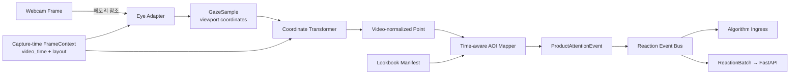

# MCM AI Lookbook Kiosk 상세 설계 및 병렬 개발 계획

- 문서 단계: 기능별 상세 설계 계획 v0.2
- 기준 문서: `README.md`, `docs/OVERALL_DESIGN.md`
- 추가 요구사항: 외부 GitHub·Hugging Face Eye Tracking/표정 탐지 모델을 비교한 뒤 별도 Vision 서버에서 실행하고, 시선 위치를 영상 속 상품과 실시간으로 연결한다.
- 일정 기준: 4인 팀, 10일 개발 스프린트

> 이 문서는 추천 알고리즘의 신호별 가중치를 확정하지 않는다. AI 모델 선택과 추천 알고리즘 연구가 진행되는 동안에도 FE·BE·AI가 멈추지 않고 병렬 개발할 수 있는 계약과 통합 순서를 정의한다.

> 원격 추론은 [`ADR-0001`](adr/0001-remote-vision-inference.md)의 Proposed 방향이다. ADR 승인 전에는 실제 고객 frame을 원격 전송하지 않고 Fake·Replay와 실행 중 생성한 synthetic frame으로 transport를 검증한다.

## 1. 상세 설계 목표

1. 네 명이 서로 다른 디렉터리와 계약을 기준으로 매일 독립적인 PR을 만들 수 있어야 한다.
2. Eye Tracking과 표정 탐지 모델이 아직 정해지지 않아도 mock 데이터로 전체 흐름을 개발할 수 있어야 한다.
3. 외부 모델을 바꾸더라도 Kiosk, Backend와 추천 알고리즘 코드는 바뀌지 않아야 한다.
4. 시선 좌표와 영상 재생 시각을 결합해 고객이 보고 있는 상품을 실시간으로 식별해야 한다.
5. 원본 웹캠 frame은 동의된 세션에서 Vision 서버로 일시 전송하되 어디에도 저장·로그하지 않고, 파생 신호만 기존 계약에 따라 전달·저장해야 한다.
6. 작은 PR을 매일 `main`에 합쳐 항상 실행 가능한 상태를 유지해야 한다.

## 2. 병렬 개발 핵심 원칙

### Contract First

생산자와 소비자가 같은 코드를 기다리지 않도록 데이터 계약과 예제 fixture를 구현보다 먼저 합친다.

```text
Contract PR
  → Producer PR: Eye·Face·Kiosk가 계약 형식으로 데이터 생성
  → Consumer PR: Backend·추천·UI가 같은 fixture를 소비
  → Wiring PR: 실제 구현끼리 연결
```

계약 변경과 기능 구현을 같은 PR에 넣지 않는다. 계약을 먼저 병합한 뒤 각 팀원이 최신 `main`에서 자신의 구현을 진행한다.

### Adapter First

외부 모델 코드를 서비스 코드에 직접 넣지 않는다.

```text
공통 Adapter Interface
  ├─ Fake Adapter          개발·CI용
  ├─ Replay Adapter        기록된 파생 fixture 재생용
  ├─ Candidate A Adapter   후보 실험용
  ├─ Candidate B Adapter   후보 실험용
  └─ Selected Adapter      최종 선택 모델
```

모델 교체는 Adapter 내부에서만 발생하고, Adapter 출력 이후의 AOI 매핑·Backend·추천 코드는 유지한다.

### Mock First

- FE는 실제 Eye/Face 모델 대신 시간별 가짜 신호를 재생해 S03과 S04를 개발한다.
- BE는 실제 카메라 대신 JSON fixture를 받아 저장과 추천 인터페이스를 개발한다.
- AI 담당자는 Kiosk와 Backend를 실행하지 않고도 Adapter contract test를 통과시킨다.
- 실제 모델은 선정 근거가 확정된 뒤 마지막 연결 단계에서 교체한다.

### Small PR and Trunk Based Development

- 장기 통합 브랜치를 만들지 않는다.
- 하루 안에 리뷰 가능한 한 가지 책임만 PR에 담는다.
- 완성되지 않은 기능은 feature flag와 mock 구현으로 감추고 `main`의 실행 가능 상태를 유지한다.
- 공용 파일 변경은 별도 PR로 먼저 병합한다.

## 3. 팀원별 작업 경계

| 팀원 | 주 소유 영역 | 제공하는 계약 | 주 소비자 |
| --- | --- | --- | --- |
| 박형진 | FastAPI, Vision Gateway·배포, PostgreSQL, 추천 인터페이스, QR, 매니저 알림, CI·GitHub 운영 | Session, Vision Stream, ReactionBatch, RecommendationResult, ManagerEvent, ConversionOutcome | FE, Eye, Face |
| 양유상 | Eye 모델 조사·벤치마크·Adapter, 보정, 시선 좌표, AOI 매핑 | GazeSample, ProductAttentionEvent, Eye model report | FE, BE·추천 |
| 정은미 | 표정 모델 조사·벤치마크·Adapter, 출력 정규화·품질 | ExpressionSample, Face model report | BE·추천 |
| 조윤혜 | Kiosk S01-S04, 영상·웹캠 orchestration, `RemoteVisionClient`, 시선 debug UI, Manager UI | FrameContext, VideoLayout, binary frame producer, 화면 상태와 사용자 이벤트 | Vision Gateway, Eye, Face, BE |

### 공용 계약 변경 승인

- 계약 관리: 박형진
- Eye 계약 변경: 양유상 + 박형진 + 조윤혜 리뷰
- Face 계약 변경: 정은미 + 박형진 + 조윤혜 리뷰
- Recommendation·Manager 계약 변경: 박형진 + 조윤혜 리뷰
- 룩북 manifest 변경: 양유상 작성, 박형진이 상품 ID를 확인하고 조윤혜가 영상 시간·좌표를 확인

## 4. 권장 저장소 경계

실제 생성 시 현재 저장소 구조에 맞게 이름을 조정하되 소유 경계는 유지한다.

```text
apps/
  kiosk/                       # 조윤혜: S01-S04, video, webcam, VisionClient
  manager/                     # 조윤혜 FE + 박형진 API 계약
  api/                         # 박형진: FastAPI
  vision-gateway/              # 박형진 관리 + Eye·Face 공동 리뷰: WSS, auth, limits, worker orchestration

services/
  eye/                         # 양유상: Eye adapters, calibration, AOI mapper
  face/                        # 정은미: Face adapters, score normalization
  recommendation/              # 박형진: mock/실제 추천 엔진 경계

contracts/
  openapi.yaml                 # REST 계약
  events/                      # Manager polling 이벤트 JSON Schema
  vision-stream/               # ADR 승인 후 추가: binary transport와 control/error 계약
  lookbook-manifest.schema.json
  examples/                    # 정상·오류·경계 fixture

data/
  lookbooks/<video-version>/manifest.json
  products/catalog.json

experiments/
  eye/<candidate-id>/          # 후보별 독립 환경·벤치마크
  face/<candidate-id>/

tests/
  contract/
  integration/
  replay/
  e2e/

docs/
  adr/                         # 모델·기술 선택 기록
  benchmarks/                  # 비교 결과와 재현 방법
```

### 충돌이 잦은 파일 관리

다음 파일은 박형진이 직렬로 관리하고, 다른 팀원은 기능 PR에서 함께 수정하지 않는다.

- 루트 dependency·lock 파일
- Docker·배포 공통 설정
- `contracts/`
- 상품 catalog
- PostgreSQL migration 순서
- 공통 CI와 CODEOWNERS
- README 설계 문서 링크

AI 후보마다 의존성 환경을 분리해 서로 다른 모델 라이브러리가 한 lock 파일에서 충돌하지 않게 한다.

## 5. Contract v1

### 공통 이벤트 필드

모든 파생 이벤트는 다음 필드를 공통으로 가진다.

| 필드 | 의미 |
| --- | --- |
| `schema_version` | 계약 버전 |
| `session_id` | 개인 계정과 무관한 키오스크 세션 ID |
| `event_id` | 재전송 중복 제거용 ID |
| `sequence` | 세션 안의 이벤트 순서 |
| `frame_id` | 같은 프레임에서 나온 Eye·Face 결과 연결 키 |
| `captured_at_mono_ms` | 프레임을 캡처한 단조 증가 시각 |
| `video_id` | 재생한 룩북 영상 ID |
| `video_time_ms` | 프레임 캡처 순간의 영상 재생 시각 |
| `producer_id` | 이벤트 생성 Adapter·모듈 ID |
| `model_revision` | 사용한 외부 모델의 고정 revision |
| `valid` | 신호가 사용 가능한지 여부 |
| `confidence` | 모델 또는 측정 품질 0~1 |
| `reason` | 무효·오류 원인 |

무효 데이터를 좌표 `(0, 0)`이나 중립 표정으로 위장하지 않는다. `valid=false`와 `reason`으로 전달해 알고리즘이 데이터 부족과 무관심을 구분할 수 있게 한다.

### 시간 규칙

- Eye와 Face 결과의 기준 시각은 추론 완료 시점이 아니라 원본 프레임을 캡처한 시점이다.
- `video_time_ms`는 캡처 순간의 룩북 재생 시각을 사용한다.
- 영상 pause·seek·replay를 구분하기 위해 `playback_epoch`을 둔다.
- scene과 AOI 시간 구간은 `start_ms <= video_time_ms < end_ms`로 판정한다.
- Eye와 Face 주기가 다르면 설정 가능한 허용 시간 차 안에서 가장 가까운 sample을 결합한다.

### 좌표 규칙

- 화면 좌상단을 원점으로 사용한다.
- 공통 좌표는 `0.0~1.0` 정규화 좌표를 사용한다.
- Eye Adapter는 Kiosk viewport 기준 좌표를 출력한다.
- AOI Mapper가 letterbox, crop, `object-fit`, resize를 반영해 영상 content 기준 좌표로 변환한다.
- 검은 여백이나 영상 밖을 본 경우 상품을 임의로 연결하지 않는다.

### 주요 계약

| 계약 | 생산자 | 소비자 | 역할 |
| --- | --- | --- | --- |
| `FrameContext` | Kiosk | Eye·Face | 프레임 ID, 캡처 시각, 영상 시각과 화면 배치 정보 |
| `GazeSample` | Eye Adapter | AOI Mapper, debug UI | 화면 시선 좌표와 품질 |
| `ExpressionSample` | Face Adapter | Observation Joiner | 관찰된 표정 점수와 품질 |
| `LookbookManifest` | AI·FE | AOI Mapper, Backend | 시각별 상품 노출 영역 |
| `ProductAttentionEvent` | AOI Mapper | 추천 입력·저장 | 시선과 현재 노출 상품의 교차 결과 |
| `ReactionBatch` | Kiosk·Signal Transport | FastAPI | 소량의 파생 이벤트 묶음 |
| `RecommendationResult` | Recommendation Engine | Kiosk·Manager | Top 2, 상태, 알고리즘 버전 |
| `ManagerEvent` | FastAPI | Manager Screen | 고객의 S04 제품 요청 알림 |
| `ConversionOutcome` | Manager 또는 후속 연동 | FastAPI·PostgreSQL | 추천 후 착용·구매 결과 |

## 6. Lookbook Manifest와 AOI

Eye Tracker는 시선 좌표만으로 상품을 알 수 없다. 미리 제작된 룩북의 시간대별 상품 위치를 manifest로 정의해 시선 좌표와 결합한다.

```json
{
  "schema_version": "1.0",
  "video_id": "mcm-lookbook-v1",
  "manifest_version": "1.0",
  "coordinate_space": "video_normalized",
  "exposures": [
    {
      "exposure_id": "scene-01-product-01",
      "product_id": "P001",
      "start_ms": 0,
      "end_ms": 5000,
      "priority": 0,
      "shape": {
        "type": "polygon",
        "points": [[0.10, 0.20], [0.45, 0.20], [0.45, 0.85], [0.10, 0.85]]
      }
    }
  ]
}
```

- 상품이 움직이면 하나의 상품을 여러 시간 구간과 polygon으로 나눈다.
- 한 장면에 여러 상품이 있으면 각각 별도의 AOI를 둔다.
- AOI가 겹치면 모든 후보와 우선순위를 전달하고, 최종 관심 상품 판단은 알고리즘 규칙에 맡긴다.
- manifest가 바뀌면 버전을 올리고 모든 분석 이벤트에 해당 버전을 기록한다.
- 개발 환경에서는 FE가 AOI와 시선 위치를 overlay로 표시해 영상과 좌표가 맞는지 검증한다.

## 7. Eye Tracking 상세 설계

### 역할 경계

Eye 모듈의 책임은 다음 두 단계까지만이다.

1. 웹캠 프레임으로 화면상의 point-of-gaze와 품질을 추정한다.
2. 시선 좌표·영상 시각·AOI를 결합해 현재 보고 있는 상품 후보를 만든다.

머문 시간, 재시선 횟수, 가중치와 최종 Top 2 계산은 추천 알고리즘의 책임이다.

### Adapter Interface

```text
metadata()       → model_id, revision, runtime, calibration capability
initialize()     → 모델과 실행 환경 준비
warmup()         → 첫 추론 지연 제거
calibrate()      → 필요한 경우 화면 보정
infer(frame)     → GazeSample
dispose()        → 모델·카메라 관련 자원 해제
```

후보가 눈 landmark 또는 3차원 gaze vector만 제공한다면 그대로는 요구사항을 충족하지 않는다. 화면 좌표로 변환하는 calibration layer를 거쳐 `GazeSample`을 만들 수 있을 때만 Eye 후보로 평가한다.

### GazeSample 예시

```json
{
  "schema_version": "1.0",
  "session_id": "session-example",
  "event_id": "gaze-example-00421",
  "sequence": 421,
  "frame_id": "frame-00421",
  "captured_at_mono_ms": 143220.4,
  "video_id": "mcm-lookbook-example-v1",
  "video_time_ms": 12840,
  "playback_epoch": 0,
  "screen_x_norm": 0.63,
  "screen_y_norm": 0.41,
  "confidence": 0.88,
  "valid": true,
  "reason": null,
  "calibration_id": "calibration-example",
  "producer_id": "eye-adapter-candidate",
  "model_revision": "pinned-revision"
}
```

### 시선에서 상품까지의 실시간 처리



처리 순서는 다음과 같다.

1. Kiosk가 프레임을 캡처하는 순간 `video_time_ms`와 실제 영상 표시 영역을 함께 고정한다.
2. Eye Adapter가 viewport 기준 시선 좌표를 출력한다.
3. Coordinate Transformer가 캡처 당시 layout을 사용해 영상 content 기준 좌표로 변환한다.
4. 시선이 영상 밖이면 `outside_video`로 처리한다.
5. AOI Mapper가 `video_time_ms`에 활성화된 상품 영역을 찾고 point-in-polygon을 수행한다.
6. 상품 hit 후보를 `ProductAttentionEvent`로 만들어 알고리즘 입력 흐름에 전달한다.
7. 파생 이벤트는 소량 batch 또는 stream으로 Backend에 전달한다.

추론이 늦게 끝나더라도 완료 시점의 영상 시간을 다시 읽지 않는다. 캡처 시각을 사용하지 않으면 시선이 다음 장면의 상품으로 잘못 연결될 수 있다.

### Eye 필수 테스트

- 영상 정중앙·모서리·9-point 보정 위치 오차
- letterbox, crop, 화면 resize와 서로 다른 해상도
- 고정·이동·겹침 AOI
- 장면 시작·종료 경계
- 영상 pause, seek와 replay
- 안경, 조도, 거리와 머리 이동
- no-face, multi-face, low-confidence, 화면 밖
- 추론 지연과 순서가 뒤바뀐 결과

## 8. 표정 탐지 상세 설계

### 역할 경계

표정 모듈은 프레임에서 관찰 가능한 표정 관련 점수와 품질을 출력한다. 실제 감정, 성격 또는 구매 의도를 확정하지 않는다.

```text
metadata()
initialize()
warmup()
infer(frame) → ExpressionSample
dispose()
```

### ExpressionSample 핵심 필드

- `frame_id`, `captured_at_mono_ms`, `video_time_ms`
- `face_detected`, `face_count`, `valid`, `reason`
- `scores: { label: 0..1 }`
- `quality`, `taxonomy_version`
- `adapter_id`, `model_revision`

후보별 label이 다르므로 Adapter가 원 모델 출력과 공통 taxonomy의 대응 관계를 버전으로 관리한다. 억지로 대응할 수 없는 label은 `unknown`으로 남긴다. 최종 taxonomy는 후보 비교와 알고리즘 연구 후 확정한다.

### 시간 결합

- 같은 `frame_id`의 Eye와 Face 결과를 우선 결합한다.
- 처리 주기가 다르면 캡처 시각이 가장 가까운 값을 허용 범위 안에서 결합한다.
- Face 결과가 늦거나 없더라도 Eye 이벤트 흐름을 막지 않는다.
- 결측값은 `null`과 품질 정보로 전달하며 중립 표정으로 대체하지 않는다.

### Face 필수 테스트

- face/no-face/multi-face 처리
- 같은 조건에서의 score 흔들림과 시간 안정성
- 조명, 얼굴 각도, 거리, 안경과 부분 가림
- 후보 label의 공통 taxonomy 변환
- p50/p95 추론 지연, FPS, CPU/GPU/RAM
- 모델 오류 후 복구와 자원 해제

## 9. 외부 모델 조사·선정 절차

Eye와 Face는 GitHub·Hugging Face 후보를 비교하되 현재 문서에서 특정 모델을 미리 선택하지 않는다. Eye는 [`D2 Eye Tracker 전수 조사·추천 계획`](benchmarks/EYE_CANDIDATE_RESEARCH_PLAN.md)을 공식 기준으로 사용하고, Face는 최소 3개 후보의 동일 조건 비교를 유지한다.

### 후보 등록

Eye는 기준일·검색식·API page·중복 제거를 기록하며 공개 검색에서 발견 가능한 RGB 웹캠 후보 전체를 등록한다. Face는 최소 3개 후보를 등록한다. 공통 기록 항목은 다음과 같다.

- GitHub URL 또는 Hugging Face model ID
- 정확한 commit SHA 또는 revision
- code license와 weight license
- 상업적 전시·수정·재배포 가능 여부
- 최종 업데이트와 유지보수 상태
- 입력·출력 형식과 전처리
- calibration 필요 여부
- Python·JavaScript·ONNX 등 runtime
- 모델과 의존성 크기
- CPU·GPU·브라우저 요구사항
- 네트워크 연결 필요 여부
- 알려진 제한과 실패 조건

### Hard Gate

다음 후보는 점수 비교 전에 제외한다.

- 라이선스가 불명확하거나 프로젝트 사용 조건과 맞지 않음
- commit·revision을 고정할 수 없어 실행 결과 재현이 어려움
- 팀이 관리·승인하지 않은 외부 API나 제3자 서비스로 원본 frame을 전송해야 함
- 원본 영상을 저장하도록 강제함
- 대상 Vision 서버 환경에서 설치·실행되지 않음
- Eye 결과를 calibration 후에도 화면 좌표로 변환할 수 없음
- 위험한 설치 스크립트나 검증되지 않은 원격 코드를 반드시 실행해야 함

모델 weight는 Git에 직접 넣지 않는다. URL, revision, SHA256, license와 재현 가능한 다운로드 절차만 관리한다.

Eye 후보는 `pass-commercial`, `pass-demo-only`, `deferred`, `fail` 상태를 사용한다. 사용자 후기는 GitHub Issues·Discussions, Hugging Face Discussions, Reddit, Stack Overflow와 독립 개발자 글에서 수집하되, 인기도와 단일 후기를 정확도 증거로 사용하지 않는다.

### 동일 조건 Benchmark

Eye D2 Smoke는 설치·모델 load·출력·offline 경계만 확인한다. D2-4 상위 최대 3개와 Face 비교 후보를 D4 이후 동일 하드웨어, fixture, 보정 절차와 입력 순서로 cold/warm 각각 반복 실행한다.

| 분류 | Eye 평가 | Face 평가 |
| --- | --- | --- |
| 품질 | AOI hit 정확도, 화면 target 오차, valid sample 비율, fixation jitter | 검증 label이 있을 때 macro-F1·class recall, neutral false-positive, score stability |
| 실시간성 | p50/p95 지연, FPS, 첫 결과 시간 | p50/p95 지연, FPS, 첫 결과 시간 |
| 강건성 | 조도, 안경, 거리, 머리 이동, 화면 가장자리, 재검출 | 조도, 각도, 안경, 가림, no-face, 재검출 |
| 자원 | CPU/GPU/RAM, 모델 크기, warmup 시간 | CPU/GPU/RAM, 모델 크기, warmup 시간 |
| 운영 | 서버 설치 재현성, warmup, 연결 단절·재시작 복구 | 서버 설치 재현성, warmup, 연결 단절·재시작 복구 |
| 법적·보안 | code·weight license, revision 고정, 원본 frame 비저장 | code·weight license, revision 고정, 원본 frame 비저장 |

실제 정답 label이 없는 시연 영상의 결과는 `정확도`가 아니라 `안정성 관찰`로 기록한다.

### 선택 결과

Eye는 D2-4에서 primary·fallback·상용 가능 대안을 1차 추천하고 D4 상위 최대 3개를 정한다. 이는 최종 선택이 아니며 D4 동일 조건 benchmark와 D5 서버 workload 검증 후 영역별 ADR을 작성한다.

- 선택 모델과 fallback 모델
- 고정 revision과 checksum
- 테스트 환경과 재현 명령
- 정량 결과와 실패 사례
- 선택 이유와 포기한 장점
- 알려진 한계
- 재평가 조건

후보 실험 PR은 서비스 코드와 분리하고, 최종 선택 Adapter만 production 경로에 연결한다.

## 10. Signal Transport와 추천 경계

### FrameSource

- Kiosk가 웹캠을 한 번만 열고 frame과 캡처 시점 `FrameContext`를 `RemoteVisionClient`에 전달한다.
- 처리 속도가 느리면 오래된 프레임을 쌓지 않고 최신 프레임을 우선한다.
- frame은 base64 JSON으로 만들지 않고 고객 동의가 유효한 동안 binary WSS로만 일시 전송한다.
- 세션 종료·오류·화면 초기화 시 버퍼와 카메라 자원을 해제한다.

### Vision Stream

- 일반 FastAPI REST와 분리된 Vision Gateway가 WSS handshake, 세션 권한, 허용 origin과 resource limit를 검사한다.
- Kiosk는 기본적으로 in-flight frame을 `1`개만 허용하고 결과 또는 drop 응답 후 다음 frame을 보낸다.
- Gateway는 frame을 메모리에서 한 번 decode하고 Eye·Face Worker에 fan-out한다.
- `frame_id`, 캡처 시각, `video_time_ms`, `playback_epoch`과 layout은 서버 추론 완료 시점으로 덮어쓰지 않는다.
- proxy·Gateway·Worker는 frame body, image bytes와 embedding을 로그·APM·파일·DB·cache·queue·artifact에 남기지 않는다.
- stream의 handshake, envelope, 인증·만료, result, drop/error와 close code는 ADR 승인 뒤 별도 Contract PR로 고정한다.

### Reaction Event Bus

Vision Gateway가 반환한 `GazeSample`과 `ExpressionSample`은 Kiosk의 실시간 event bus에 전달한다. AOI Mapper 위치가 Kiosk 또는 서버 중 어디가 되더라도 Contract v1 좌표·시간 의미는 유지하며 D5 benchmark 전에 확정한다.

Backend 전송은 매 프레임마다 HTTP 요청하지 않고 설정 가능한 소량 batch로 보낸다. 장면 전환과 세션 종료 때 남은 batch를 즉시 flush한다.

- `event_id`와 `sequence`로 재전송을 멱등 처리한다.
- 순서가 늦거나 누락된 event를 허용한다.
- Backend가 느릴 때 영상 재생을 중단하지 않는다.
- raw frame은 event에 포함하지 않는다.

Vision Stream은 원본 frame의 일시적 transport이고 `ReactionBatch`는 파생 event의 저장 transport다. 두 경계를 하나의 API나 schema로 합치지 않는다.

### 추천 입력 경계

Eye·Face 담당자는 최종 점수를 계산하지 않는다. 추천 영역이 파생 이벤트에서 다음 후보 feature를 계산할 수 있도록 전달한다.

- 상품별 유효 노출·관찰 시간
- 시선 hit와 유효 sample 수
- 상품 사이 시선 이동과 재방문 후보
- 표정 점수와 변화 후보
- 각 신호의 측정 품질
- 영상·manifest·모델·신호 정의 버전

실제 feature 채택 여부, 가중치와 Top 2 계산 방식은 논문 조사와 자체 검증 후 결정한다. 개발 중에는 `MockRecommendationEngine`을 사용하고 실제 결과처럼 표시하지 않는다.

## 11. Backend 상세 경계

### 제안 API

| Method | Path | 역할 |
| --- | --- | --- |
| `POST` | `/api/v1/sessions` | 키오스크 세션 생성 |
| `GET` | `/api/v1/lookbooks/{lookbook_id}/manifest` | 영상·AOI manifest 조회 |
| `POST` | `/api/v1/sessions/{session_id}/reaction-batches` | 파생 이벤트 batch 저장 |
| `POST` | `/api/v1/sessions/{session_id}/complete` | 분석 종료와 추천 실행 요청 |
| `GET` | `/api/v1/sessions/{session_id}/recommendations` | Top 2 결과 조회 |
| `POST` | `/api/v1/sessions/{session_id}/manager-product-requests` | 고객의 매니저 제품 요청 기록 |
| `GET` | `/api/v1/products/{product_id}` | 상품 이미지·QR 정보 조회 |
| `POST` | `/api/v1/conversions` | 착용·구매 전환 결과 저장 |
| `GET` | `/api/v1/manager/events` | polling cursor 뒤 고객 제품 요청 이벤트 조회 |
| `GET` | `/api/v1/health` | API·DB 상태 확인 |

정확한 request·response는 Contract PR의 OpenAPI와 JSON Schema로 정의한다.

### PostgreSQL 논리 테이블

| 테이블 | 핵심 책임 |
| --- | --- |
| `sessions` | 세션 상태, Kiosk, 동의 version과 시작·종료 시각 |
| `products` | 상품 정보, 이미지, 공식 URL과 QR asset |
| `lookbooks` | 영상과 manifest version |
| `reaction_batches` | 원본이 아닌 파생 이벤트 batch와 schema version |
| `recommendation_runs` | 사용한 algorithm version과 결과 상태 |
| `recommendation_items` | 추천 순위와 product ID |
| `manager_events` | 고객의 제품 요청 알림과 polling cursor |
| `conversion_outcomes` | 세션·상품별 착용·구매 결과 |
| `model_registry` | Eye·Face 모델 revision, checksum, license와 상태 |

원본 이미지, 영상, base64, 얼굴 embedding과 파일 경로를 저장하는 컬럼은 만들지 않는다. 정확한 컬럼과 보존 기간은 DB·개인정보 상세 설계에서 확정한다.

## 12. Kiosk·Manager Frontend 상세 경계

### S01. Screensaver

- 이전 세션·카메라·분석 buffer·추천 결과 초기화
- 고객 터치 시 S02 메뉴로 이동
- 이 단계에서는 분석 세션이나 매니저 알림을 만들지 않음

### S02. Main Menu

- 카테고리 탐색과 AI 추천 선택
- 카메라·파생 데이터 저장·추천 개선 목적 안내
- AI 추천을 선택하고 동의가 완료되면 분석 세션을 생성
- 동의하지 않으면 카메라 분석 없이 다른 흐름 제공

### S03. AI Lookbook

- 카메라 권한과 FrameSource 관리
- 룩북 영상과 manifest version 확인
- 영상 재생 시각·layout을 FrameContext로 생성
- Eye·Face Adapter 실행
- 개발 모드에서 시선·AOI·품질 overlay 표시
- 오류·데이터 부족·중단 상태 처리

### S04. Analysis Report

- 추천 상태와 Top 2 표시
- 상품 이미지와 각 상품의 사전 생성 QR 표시
- mock과 실제 추천 결과를 개발·검증 환경에서 구분
- 고객이 원할 때만 `매니저에게 제품 요청` 버튼으로 Top 2 응대를 요청
- 일정 시간 뒤 다음 고객을 위해 전체 상태 초기화

### Manager Screen

- polling으로 고객의 제품 요청 이벤트를 조회
- 요청된 세션의 Top 2와 `view_recommended_products` 의도를 표시
- `event_id` 중복 제거와 `after_sequence` cursor를 유지
- MVP에서는 추천 후 착용·구매 결과를 해당 세션에 기록하는 입력 제공

고정 상품 QR만으로는 어느 분석 세션이 구매로 이어졌는지 알 수 없다. 따라서 MVP의 구매 전환 기록은 매니저 세션 카드 입력을 기본안으로 하고, POS·CRM 자동 연동은 후속 기능으로 둔다.

## 13. QR 상세 경계

1. 상품 catalog의 공식 URL을 확인한다.
2. `python-qrcode`로 상품별 QR 자산을 미리 생성한다.
3. QR과 상품 이미지·product ID를 연결한다.
4. S04의 각 상품 카드에 해당 QR을 표시한다.
5. 실제 Kiosk 화면에서 iOS·Android 스캔을 확인한다.
6. URL이 바뀌면 QR을 재생성한다.

QR에는 원본 반응 데이터나 얼굴 관련 정보는 넣지 않는다.

## 14. PR과 병합 규칙

### Branch와 PR 크기

- 예시: `feat/eye/d03-gaze-adapter`, `feat/face/d03-expression-adapter`, `feat/kiosk/d04-s03-ui`, `feat/api/d04-reaction-ingest`
- 한 PR은 한 책임만 다룬다.
- 목표는 하루 이내, non-generated 변경 약 100~300줄이다.
- 계약, migration, 기능 구현과 대형 dependency 변경을 한 PR에 섞지 않는다.
- 병합은 squash merge를 사용한다.

### 병합 순서

```text
1. Contract·fixture PR
2. Producer PR
3. Consumer PR
4. Wiring PR
5. 실제 모델 선택 Adapter PR
```

### 공용 파일 규칙

- 이미 병합된 DB migration을 수정하지 않고 새 migration을 추가한다.
- 계약 v1은 optional field 추가처럼 호환 가능한 변경만 허용한다.
- 필드 삭제·이름 변경은 계약 v2에서 수행한다.
- 자동 생성 타입은 직접 수정하지 않고 schema에서 다시 생성한다.
- 모델 후보마다 공용 registry를 직접 수정하지 않고 독립 metadata 파일을 둔다.

### PR 본문 필수 항목

- 목적과 범위 밖 항목
- 변경한 계약·DB·feature flag
- 실행한 테스트와 결과
- 실패·fallback 동작
- 원본 프레임이 파일·DB·로그에 남지 않는지 확인
- 모델 사용 시 URL, revision, license, checksum
- UI screenshot 또는 benchmark 결과
- 되돌리는 방법

### Review 규칙

- domain PR은 해당 영역 외 팀원 1명이 승인한다.
- producer와 consumer가 연결되는 PR은 양쪽 담당자가 리뷰한다.
- 계약 PR은 박형진과 영향받는 생산자·소비자가 승인한다.
- CI 실패와 unresolved review가 없는 상태에서만 병합한다.

## 15. 매일 개발·병합 루틴

| 시간 | 활동 |
| --- | --- |
| 09:30 | 15분 동기화: 오늘 계약 변경, 의존 PR과 blocker 확인 |
| 10:00 | 최신 `main`에서 하루짜리 작업 브랜치 생성 |
| 14:00 | Draft PR 생성, fixture·screenshot·benchmark 초안 공유 |
| 16:00 | 리뷰 요청 마감, 생산자·소비자 간 계약 확인 |
| 17:00 | 병합 시간: 작은 PR을 순서대로 squash merge |
| 17:30 | 최신 `main`에서 mock E2E smoke test |
| 종료 전 | 다음 날 작업 issue와 필요한 계약 변경을 미리 작성 |

긴 작업은 하나의 큰 PR로 유지하지 않고 `contract → skeleton → behavior → integration` 순서의 여러 PR로 나눈다.

## 16. 10일 병렬 개발 일정

### D1. 계약과 골격

| 담당 | 하루 결과물 |
| --- | --- |
| 박형진 | 저장소 경계, CI, PR template, CODEOWNERS와 Contract v1을 작은 PR로 순차 병합 |
| 양유상 | `EyeAdapter`, `FakeEyeAdapter`, Eye benchmark protocol |
| 정은미 | `FaceAdapter`, `FakeFaceAdapter`, Face benchmark protocol |
| 조윤혜 | S01-S04 state machine, mock `ApiClient`·`VisionClient` 경계 |

**통합 Gate A:** 공통 예제 JSON이 FE·Eye·Face·BE contract test를 모두 통과한다.

### D2. 세션 Mock과 Eye 후보 조사

| 담당 | 단계별 결과물 |
| --- | --- |
| 박형진 | Session·동의 API, stream 권한·만료 설계, 상품 catalog seed, PostgreSQL 초기 migration |
| 양유상 | 아래 D2-1~D2-4를 순서대로 수행해 Eye 전수 inventory·Hard Gate·Smoke·1차 추천 기록 |
| 정은미 | Face 후보 3개 이상 inventory, revision·license·실행 smoke 기록 |
| 조윤혜 | S01·S02, 원격 frame 전송을 구분한 동의·취소·timeout UI를 mock API로 구현 |

#### D2-1. Eye 공개 후보 전수 발견

- GitHub·Hugging Face의 고정 검색어, 기준 시각과 모든 API page를 기록한다.
- 검색당 1,000건을 넘는 GitHub 결과는 생성일 구간으로 분할한다.
- fork·wrapper·동일 weight를 canonical family 기준으로 중복 제거한다.
- 발견한 모든 후보에 포함·범위 밖·보류 사유를 남긴다.

#### D2-2. Eye Hard Gate와 사용자 후기

- source·weight revision, checksum, code·weight license, RGB 입력, calibration·화면 좌표 경로와 offline 실행을 확인한다.
- GitHub Issues·Discussions, Hugging Face Discussions, Reddit, Stack Overflow와 독립 사용기에서 설치·보정·환경·성능·유지보수 후기를 수집한다.
- 후보를 `pass-commercial`, `pass-demo-only`, `deferred`, `fail`로 분류한다.

#### D2-3. Eye 통과 후보 전수 Smoke

- 통과 후보를 개수 제한 없이 독립 환경에서 online·offline으로 실행한다.
- Linux x86-64, 4 vCPU·16 GiB·Python 3.13.15를 우선하고 후보 예외는 해당 실험에만 고정한다.
- initialize·warmup·infer·no-face/invalid·dispose와 출력·자원 관찰을 기록하되 정확도라고 표현하지 않는다.

#### D2-4. Eye 점수화와 1차 추천

- Hard Gate와 Smoke 통과 후보만 품질·실시간성·통합·법적/보안·후기·비용 100점 기준으로 평가한다.
- 총점 70점, evidence coverage 80% 이상인 후보 중 primary와 다른 family의 fallback을 추천한다.
- primary가 연구·비상업 전용이면 가장 높은 상용 가능 대안도 제시한다.
- D4 동일 조건 benchmark에는 상위 최대 3개만 진입시키며 적격 후보가 부족하면 수를 채우지 않는다.

D2-1~D2-4는 새로운 sprint 일자를 추가하는 이름이 아니라 D2 내부의 순차 Gate다. 조사량에 따라 각각 작은 PR로 나누며, 완료되지 않은 값을 추정해 다음 Gate로 넘기지 않는다.

### D3. 입력과 관측 경계

| 담당 | 하루 결과물 |
| --- | --- |
| 박형진 | ADR 승인 후 Vision Stream v1 Contract와 synthetic WSS harness; Reaction ingest stub은 파생 event 전용으로 유지 |
| 양유상 | `FrameContext → GazeSample` replay runner와 보정 fixture |
| 정은미 | `FrameContext → ExpressionSample` replay runner와 no-face 의미 정의 |
| 조윤혜 | S03 video·webcam 권한, 단일 FrameSource, 캡처 시 `video_time_ms`·layout과 `RemoteVisionClient` fake 경계 생성 |

### D4. AOI와 Mock 결과

| 담당 | 하루 결과물 |
| --- | --- |
| 박형진 | FakeEye·FakeFace 기반 Vision Gateway WSS scaffold, 파생 event 저장, `MockRecommendationEngine` |
| 양유상 | manifest·AOI Mapper, 시간·polygon·겹침 unit test, D2-4 상위 최대 3개 Eye 동일 조건 benchmark |
| 정은미 | Face 후보 1차 benchmark와 label 정규화 비교 |
| 조윤혜 | binary frame producer의 in-flight `1`·drop 처리, mock 시선·AOI overlay, S04 mock Top 2·QR |

### D5. 외부 모델 선택 Gate

| 담당 | 하루 결과물 |
| --- | --- |
| 박형진 | [`Vision 서버 선정 계획`](benchmarks/VISION_SERVER_SELECTION_PLAN.md)의 공통 harness·network·동시 세션·비용표, Recommendation·Manager event 계약, ADR 리뷰 주관 |
| 양유상 | D4 Eye 결과와 목표 서버 workload를 결합한 최종 비교표, 선택·fallback ADR, capture-to-result·자원 test |
| 정은미 | 목표 서버의 Face 비교표, 선택·fallback ADR, capture-to-result·자원 smoke test |
| 조윤혜 | 실제 생성 타입·RemoteVisionClient 연결, 전송 해상도·FPS 비교와 터치·오류 상태 정리 |

**통합 Gate B:** ADR-0001 승인 후 workload·모델을 고정하고 CPU → fractional GPU → full GPU, 현장 network, 동시 세션, 같은 날짜의 총비용과 보안·운영 Gate를 순서대로 통과한다. 모델 revision·license, WSS protocol, capture-to-result 지연·FPS·drop·자원·원본 비저장 기준과 목표 cloud·region·instance를 후속 ADR-0002로 확정한다. 통과하지 못하면 실제 customer frame 연결이나 Deployment PR 없이 Fake/Replay로 다른 작업을 계속한다.

### D6. 선택 모델과 실시간 파이프라인

| 담당 | 하루 결과물 |
| --- | --- |
| 박형진 | Vision Gateway 인증·origin·limit·worker orchestration과 Product reaction aggregator |
| 양유상 | 서버 Eye Worker, calibration state, 실시간 gaze·AOI output |
| 정은미 | 서버 Face Worker, 공통 score·품질 output과 안정화 처리 |
| 조윤혜 | RemoteVisionClient로 S03 WSS stream 연결, feature flag 추가 |

### D7. Replay E2E

| 담당 | 하루 결과물 |
| --- | --- |
| 박형진 | batch ingest → DB → recommendation interface 전체 경로 |
| 양유상 | Eye timeout·worker restart·calibration 만료 처리 |
| 정은미 | Face no-face·timeout·worker restart 처리 |
| 조윤혜 | synthetic frame·Replay 기반 S01→S04 E2E, drop·disconnect·retry·cancel |

**통합 Gate C:** 승인된 fixture 한 세션이 WSS Gateway를 거치고 원본 frame 저장 없이 결정적인 mock Top 2까지 통과한다.

### D8. Live Vertical Slice

| 담당 | 하루 결과물 |
| --- | --- |
| 박형진 | TLS 배포, 실제 상품·QR, Manager polling, conversion 저장 기본안 |
| 양유상 | Kiosk→서버 실제 웹캠 calibration과 장면별 AOI hit 검증 |
| 정은미 | Kiosk→서버 실제 웹캠 조도·각도·no-face 안정성 검증 |
| 조윤혜 | 실제 원격 S03·S04와 Manager 화면, Kiosk touch UI 정리 |

**통합 Gate D:** 전체 룩북 한 번을 재생해 WSS frame→서버 Eye·Face→파생 event→Top 2→QR·매니저 알림을 확인하고, proxy·Gateway·Worker·DB·로그에 원본 frame이 남지 않는지 점검한다. 추천 알고리즘이 아직 연구 중이면 결과를 mock으로 명확히 구분한다.

### D9. Release Candidate 품질

| 담당 | 하루 결과물 |
| --- | --- |
| 박형진 | Vision Gateway·API·DB 통합, origin/auth/limit, proxy·APM·로그·cache 개인정보 점검 |
| 양유상 | 최종 서버 Eye 성능 budget·failure matrix와 병목 수정 |
| 정은미 | 최종 서버 Face 성능 budget·failure matrix와 병목 수정 |
| 조윤혜 | 카메라 거부, server 불가, 데이터 부족, network 단절, 접근성·터치 E2E |

**통합 Gate E:** critical·high bug 0건, clean session reset 성공, release candidate 생성 가능 상태다.

### D10. Freeze와 시연

| 담당 | 하루 결과물 |
| --- | --- |
| 박형진 | clean-server 배포, TLS·private network·DB seed, demo reset, rollback과 release checklist |
| 양유상 | Eye revision·checksum 고정, calibration·fallback 시연 점검 |
| 정은미 | Face revision·checksum 고정, fallback 시연 점검 |
| 조윤혜 | Kiosk 해상도, QR scan, 전체 시연 동선과 UI 최종 점검 |

전원은 전체 룩북 시나리오를 두 번 연속 실행한다. D10에는 신규 기능을 추가하지 않고 문서와 치명적인 bugfix만 병합한다.

## 17. CI와 테스트 Gate

### 모든 PR에서 실행

- formatting·lint·typecheck
- JSON Schema·OpenAPI contract test
- Adapter stub unit test
- AOI Mapper 경계 test
- FastAPI unit test
- Vision Stream protocol·Gateway auth/origin/size/drop test
- PostgreSQL migration clean upgrade test
- Kiosk mock smoke test
- 원본 이미지·base64·대형 model weight가 Git에 포함되지 않았는지 검사
- 일반 REST·event schema와 로그·APM에 raw frame field 또는 payload가 없는지 검사

### 실제 모델 전용 Lane

모든 PR에서 무거운 모델을 다시 실행하지 않는다.

- PR CI: Fake·Replay Adapter와 작은 smoke test
- 수동 또는 scheduled test: 전체 weight, 목표 Vision 서버, 실제 Kiosk·network, 성능 benchmark
- D5·D9 Gate: 고정 revision과 server 사양으로 전체 비교·회귀·load benchmark
- 결과: 환경, 명령, metric JSON과 요약 표를 artifact로 남김

### 필수 Replay Fixture

- 정상 시선 이동
- 고정·이동·겹침 AOI
- 화면 밖·낮은 confidence·no-face·multi-face
- Eye·Face 처리 지연과 순서 뒤바뀜
- 영상 pause·seek·replay
- Backend 지연·중복 batch·polling cursor 재조회
- 신호가 부족한 세션

고객의 실제 원본 얼굴 영상을 Git fixture로 사용하지 않는다.

## 18. Feature Flag

개발 단계의 교체 지점을 설정으로 관리한다.

```text
EYE_ADAPTER=fake|replay|selected
FACE_ADAPTER=fake|replay|selected
RECOMMENDATION_ENGINE=mock|research_version
VISION_CLIENT=fake|replay|remote
VISION_TRANSPORT=wss
SHOW_GAZE_DEBUG=false|true
```

실제 설정 이름은 구현 시 정하되 같은 목적의 교체 지점을 유지한다.

## 19. 완료 기준

- S01부터 S04까지 mock E2E와 live vertical slice가 모두 동작한다.
- Eye와 Face 각각 후보 비교표, 재현 benchmark, 선택 ADR, 고정 revision·license·checksum과 fallback이 있다.
- Vision 서버는 workload·모델·CPU/GPU·network·동시 세션·총비용·운영 Gate를 순서대로 통과하고 ADR-0002에 cloud·region·instance와 rollback 근거가 기록되어 있다.
- 시선 좌표가 캡처 시점의 영상 시각·layout·AOI와 결합되어 product ID 후보로 전달된다.
- Eye·Face의 무효 신호가 무관심이나 중립으로 잘못 계산되지 않는다.
- 실제 추천 알고리즘이 없어도 mock 경계로 모든 팀이 병렬 개발할 수 있다.
- Top 2 상품 이미지와 각 상품 QR이 표시된다.
- S04 고객 제품 요청이 Manager polling으로 전달된다.
- 동의된 파생 반응, 추천과 구매 전환 데이터가 PostgreSQL 저장 경계를 통과한다.
- 동의된 세션만 WSS Vision Stream을 열고 미동의·철회·만료 시 camera와 연결을 닫는다.
- 원본 frame이 일반 REST API, 파일·DB·cache·queue·로그·APM·artifact·backup에 남지 않는다.
- server/network 실패를 무관심·중립 또는 Fake 결과로 바꾸지 않고 분석 불가 상태로 처리한다.
- 매일 작은 PR을 `main`에 병합하고 최신 `main`의 mock smoke test가 통과한다.

## 20. D1에 팀이 확인할 항목

구체적인 선택지, 팀장 기본안, 실행 명령과 승인 양식은 [`D1_TECHNICAL_DECISIONS.md`](D1_TECHNICAL_DECISIONS.md)에 기록한다. 다음 값은 실제 기능 구현을 병합하기 전에 팀이 확인한다.

1. 실제 Kiosk 기기, OS, 브라우저, 카메라와 현장 network 조건
2. Kiosk Frontend 기술 스택
3. 약 60초 룩북 영상의 최초 version과 상품 ID 목록
4. 점선 이동 표적을 이용한 Eye 보정 방식과 D5 성능 통과 기준
5. ADR-0001 원격 추론, 고객 동의, Vision Stream v1과 비저장 운영 원칙
6. Manager 시작 알림을 S02 AI 선택과 동의 완료 직후 전송하는 기준
7. PostgreSQL 실행 환경과 Alembic migration 운영 방식
8. 구매 전환 기록을 Manager 입력으로 시작할지 여부
9. [`Vision 서버 선정 계획`](benchmarks/VISION_SERVER_SELECTION_PLAN.md)에 따른 목표 cloud·region·CPU/GPU·동시 Kiosk 수와 성능·비용·운영 Gate 및 ADR-0002 승인
10. 동의 화면에 표시할 저장 항목과 보유 기간 결정 일정
11. Eye는 D2-1 전수 발견과 D2-4 상위 최대 3개 선정 범위, Face는 D5까지 비교할 최소 3개 후보 범위
