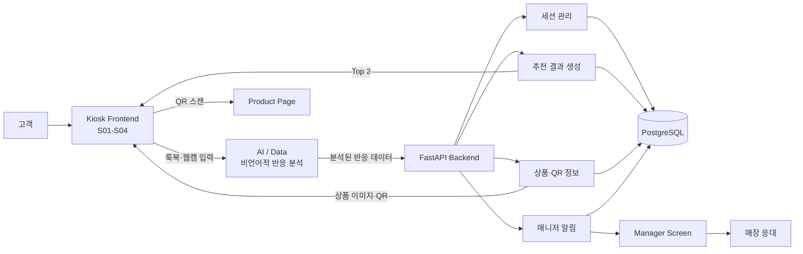

# MCM AI Lookbook Kiosk 전체 설계

- 문서 단계: 전체 설계
- 기준 문서: 루트 `README.md`
- 목적: 기능별 상세 설계 전에 서비스 구성과 전체 데이터 흐름을 정의한다.

> 이 문서는 README에 작성된 내용만 반영한다. README에서 정하지 않은 구현 방식은 임의로 확정하지 않고 `추후 상세 설계`로 구분한다.

## 1. 서비스 목표

MCM AI Lookbook Kiosk는 매장 고객이 약 60초의 룩북을 감상하는 동안 나타나는 시선, 얼굴 방향, 표정 등의 비언어적 반응을 분석해 관심도가 높은 MCM 상품 2개를 추천하는 오프라인 AI 키오스크다.

서비스는 다음 경험을 제공한다.

- 회원가입이나 설문 없이 첫 방문 고객에게 상품을 추천한다.
- 고객의 비언어적 반응을 상품 추천의 근거로 활용한다.
- 추천 상품의 이미지와 상품별 QR을 함께 제공한다.
- 매니저에게 고객 이용 상황과 추천 결과를 자동으로 전달한다.
- 분석 결과를 실제 상품 확인과 매장 응대로 연결한다.
- 비언어적 반응, 추천 결과와 구매 전환 결과를 축적해 추천 품질을 개선한다.

## 2. 사용자와 시스템 구성

| 구성 | 역할 |
| --- | --- |
| 고객 | 키오스크에서 룩북을 감상하고 추천 상품과 QR을 확인한다. |
| Kiosk Frontend | S01-S04 화면, 룩북 재생, 웹캠 입력, 사용자 조작과 추천 결과 표시를 담당한다. |
| AI / Data | 시선, 얼굴 방향, 표정 변화 등 비언어적 반응을 분석한다. |
| Backend | 세션, 분석 결과, 상품 정보, 추천 결과, QR 정보와 매니저 알림을 관리한다. |
| PostgreSQL | 비언어적 반응 데이터, 추천 결과와 구매 전환 결과 등을 저장한다. |
| Manager Screen | 고객 이용 알림과 추천 결과를 받아 매장 응대로 연결한다. |
| Product Page | 고객이 상품별 QR을 스캔한 뒤 제품 정보를 확인하는 화면이다. |

## 3. 전체 서비스 흐름

| 단계 | 고객 경험 | 시스템 처리 |
| --- | --- | --- |
| S01. Screensaver | 대기 화면을 보고 터치해 시작한다. | 대기 상태에서 메뉴 화면으로 전환한다. |
| S02. Main Menu | 카테고리를 둘러보거나 AI 추천을 선택한다. | 선택한 서비스 흐름으로 이동한다. |
| S03. AI Lookbook | 약 60초의 룩북을 감상한다. | 웹캠 입력을 받아 비언어적 반응을 분석한다. |
| S04. Analysis Report | 관심도가 높은 Top 2 상품과 각 QR을 확인한다. | 분석 데이터를 기반으로 추천 결과와 QR 정보를 제공한다. |
| 매장 연결 | QR로 상품 정보를 보거나 매니저의 안내를 받는다. | 이용 상황과 추천 결과를 매니저 화면에 전달한다. |

```text
S01 대기
  → S02 메뉴
  → S03 룩북 재생 + 웹캠 입력 + 비언어적 반응 분석
  → S04 추천 상품 Top 2 + 상품별 QR
  → 상품 정보 확인 또는 매니저 응대
```

## 4. 전체 시스템 구조



원본 웹캠 프레임은 Kiosk 밖으로 보내지 않고 동일 기기에서 분석한다. Browser Web Worker와 Kiosk-local Python runtime 중 최종 구현은 외부 모델 benchmark 후 D5에 확정하며, 기준은 [`D1_TECHNICAL_DECISIONS.md`](D1_TECHNICAL_DECISIONS.md)를 따른다.

## 5. 구성요소별 책임

### Kiosk Frontend

- S01-S04 화면을 제공한다.
- 룩북 영상을 재생한다.
- 웹캠 입력을 시작하고 분석 과정과 연결한다.
- 추천 상품 Top 2의 이미지와 각 상품의 QR을 표시한다.
- 매장용 터치 환경에 맞는 UI를 제공한다.

### AI / Data

- 시선, 얼굴 방향, 표정 변화 등 비언어적 신호를 분석한다.
- 분석 결과를 상품 추천에 활용할 수 있는 데이터로 전달한다.
- 구체적인 신호 정의, 가중치와 판단 방식은 논문·연구 조사 후 설계한다.

### FastAPI Backend

- 키오스크 이용 세션을 관리한다.
- AI 분석 결과를 전달받아 추천 처리와 연결한다.
- 추천 상품 Top 2와 QR 정보를 Kiosk Frontend에 제공한다.
- 고객 이용 상황과 추천 결과를 매니저 화면에 자동으로 전달한다.
- PostgreSQL의 저장·조회 흐름을 관리한다.

### PostgreSQL

- 키오스크 세션 정보를 저장한다.
- 분석된 비언어적 반응 데이터를 저장한다.
- 추천 결과를 저장한다.
- 구매 전환 결과를 저장한다.
- 상품과 QR 관리에 필요한 정보를 저장한다.

정확한 테이블, 컬럼과 관계는 Database 상세 설계에서 정한다.

### QR

- 상품마다 QR을 미리 생성한다.
- 추천 결과에서 상품 이미지와 해당 상품 QR을 함께 표시한다.
- QR 생성에는 `python-qrcode`를 사용한다.
- QR에 담을 최종 주소와 갱신 방식은 QR 기능 상세 설계에서 정한다.

### Manager Notification

- 고객이 키오스크를 이용하면 매니저 화면에 자동으로 알림을 보낸다.
- 추천이 완료되면 매니저가 추천 상품을 확인할 수 있도록 한다.
- 실시간 전달에는 FastAPI WebSocket을 사용한다.
- 최초 알림은 S02에서 AI 추천 선택과 데이터 처리 동의가 완료된 직후 `session_started`로 전송한다.

## 6. 데이터 흐름

1. 고객이 키오스크를 시작하고 AI 추천을 선택한다.
2. Kiosk Frontend가 룩북을 재생하고 웹캠 입력을 받는다.
3. AI / Data 영역이 고객의 비언어적 반응을 분석한다.
4. 원본 영상은 저장하지 않고 분석 후 즉시 폐기한다.
5. 분석된 비언어적 반응 데이터는 Backend로 전달한다.
6. Backend는 세션과 분석 데이터를 PostgreSQL에 저장한다.
7. 추천 알고리즘이 분석 데이터를 바탕으로 상품 Top 2를 결정한다.
8. Backend는 추천 결과와 상품별 QR 정보를 Kiosk Frontend로 전달한다.
9. Kiosk Frontend는 S04에서 상품 이미지와 QR을 표시한다.
10. Backend는 고객 이용 상황과 추천 결과를 매니저 화면에 전달한다.
11. 고객이 구매까지 이어진 경우 구매 전환 결과를 PostgreSQL에 저장한다.
12. 축적된 반응·추천·구매 전환 데이터는 향후 추천 품질을 검증하고 개선하는 데 활용한다.

구매 전환 결과를 키오스크 세션과 연결하는 구체적인 방식은 README에서 정하지 않았으므로 추후 상세 설계한다.

## 7. 저장 데이터와 비저장 데이터

| 구분 | 데이터 | 처리 방향 |
| --- | --- | --- |
| 저장하지 않음 | 웹캠 원본 영상 | 분석 후 즉시 폐기 |
| 저장 | 분석된 비언어적 반응 | PostgreSQL에 저장 |
| 저장 | 상품 추천 결과 | PostgreSQL에 저장 |
| 저장 | 구매 전환 결과 | PostgreSQL에 저장 |
| 저장 | 세션·상품·QR 관리 정보 | 서비스 운영을 위해 저장 |
| 추후 확정 | 구체적인 저장 항목 | 개인정보·Database 상세 설계에서 결정 |
| 추후 확정 | 데이터 보유 기간 | 개인정보 상세 설계에서 결정 |

## 8. 추천 정확도 개선 흐름

```text
비언어적 반응 데이터
  + 당시 추천 결과
  + 실제 구매 전환 결과
        ↓
추천 결과와 실제 행동의 관계 확인
        ↓
논문·연구 자료를 기반으로 알고리즘 설계·검증
        ↓
추천 품질 개선
```

현재 단계에서는 이 개선 방향만 정의한다. 어떤 신호를 사용할지, 신호별 가중치를 어떻게 정할지, 어떤 모델을 사용할지와 정확도를 어떻게 평가할지는 추후 알고리즘 상세 설계에서 결정한다.

## 9. 개인정보 처리 원칙

- 웹캠 원본 영상은 저장하지 않고 분석 후 즉시 폐기한다.
- 비언어적 반응 데이터, 추천 결과와 구매 전환 결과는 고객 동의를 전제로 저장한다.
- 개인 식별 정보는 최소화한다.
- 데이터는 추천 품질을 검증하고 개선하는 목적에 활용한다.
- 구체적인 저장 항목, 보유 기간과 동의 절차는 추후 설계한다.

## 10. 기술 구성

| 영역 | 기술 / 방향 | 상태 |
| --- | --- | --- |
| Kiosk Frontend | React, TypeScript, Vite | D1 팀장 기본안 |
| AI / Data | 시선·얼굴 방향·표정 변화 분석 | 알고리즘 추후 설계 |
| Backend | Python, FastAPI | README에 명시 |
| Database | PostgreSQL 17, Docker Compose, Alembic | D1 팀장 기본안 |
| QR | `python-qrcode` | README에 명시 |
| Manager Notification | FastAPI WebSocket | README에 명시 |

## 11. 팀 책임 범위

| 팀원 | 전체 설계상 책임 |
| --- | --- |
| 박형진 | 전체 파이프라인, Backend, 추천 로직, QR, 매니저 알림, GitHub 운영 |
| 양유상 | AI 영상과 Eye Tracking 기반 비언어적 데이터 추출 |
| 정은미 | Face Emotion 기반 비언어적 데이터 추출 |
| 조윤혜 | Kiosk S01-S04, 시선 시각화 UI, 브랜드 스타일링과 터치 최적화 |

## 12. 전체 설계에서 미정인 항목

- 룩북의 최종 영상 구성
- 영상에 등장할 상품 수와 노출 방식
- 비언어적 신호의 정확한 정의
- 신호별 가중치와 추천 알고리즘
- 성향과 선호 제품을 판단하는 기준
- Browser Web Worker와 Kiosk-local Python 중 최종 AI runtime
- 실제 Kiosk 기기·카메라 사양과 보정 통과 기준
- PostgreSQL의 상세 schema
- 구매 전환 결과 수집 방식
- Contract v1 이후 추가할 매니저 상태 정보
- 개인정보 저장 항목, 보유 기간과 동의 절차
- 배포와 운영 환경

## 13. 후속 기능별 상세 설계 순서

전체 설계를 기준으로 다음 기능을 순서대로 상세 설계한다.

1. S01-S04 화면과 상태 전환
2. 룩북 영상 재생과 상품 구성
3. 웹캠 입력과 비언어적 신호 분석
4. 분석 데이터 구조와 PostgreSQL 저장
5. 논문·연구 기반 추천 알고리즘
6. Top 2 결과 화면과 상품별 QR
7. 매니저 WebSocket 알림과 응대 화면
8. 구매 전환 결과 수집과 추천 개선
9. 개인정보 동의·보유·폐기
10. 배포·운영·오류 처리
