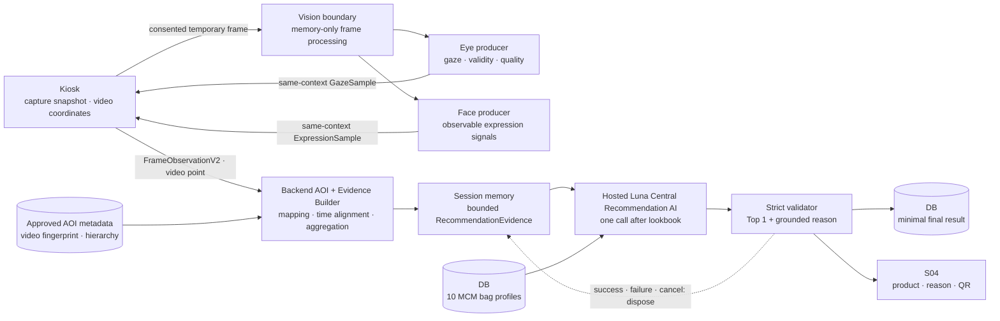

# MCM AI Lookbook Kiosk 전체 설계

- 상태: **Current canonical design**
- 승인 기준일: 2026-08-18
- 기준선: `dev` commit `77ae806192db56ef2472439a0359380e7025fae2`
- 핵심 결정: [`ADR-0006 중앙 판단 추천 AI`](adr/0006-central-recommendation-ai.md), hosted migration은 [`ADR-0008`](adr/0008-openai-luna-central-recommendation.md)
- 구현 순서: [`IMPLEMENTATION_PLAN.md`](IMPLEMENTATION_PLAN.md)

## 1. 목표

33.5초 actual 룩북 `mcm-lookbook-v2`에서 관찰된 시선·표정의 저수준 파생 신호를 캡처 시각과 검수된 상품 장면에 맞춰 결합하고, hosted `gpt-5.6-luna` 중앙 판단 AI가 MCM 가방 10개 중 한 개를 추천한다. 60초 `mcm-central-ai-replay-v2`는 synthetic 검증 fixture로만 유지한다. 고객에게는 상품과 함께 “이번 세션에서 무엇이 관찰되어 추천했는지”를 비진단적으로 설명한다.

MVP의 성공 조건은 다음과 같다.

1. Eye·Face 생산자 결과가 동일한 capture snapshot과 video time 기준으로 결합되고, Backend만 승인 AOI로 상품 구간을 연결한다.
2. 원본 frame 없이 bounded JSON evidence만 중앙 AI에 전달된다.
3. 룩북 종료 후 세션당 중앙 AI를 한 번 호출한다.
4. DB의 검수된 MCM 가방 정확히 10개만 후보이며 결과는 Top 1이다.
5. frame 단위 파생 evidence는 세션 메모리에서 사용한 뒤 폐기한다.
6. 추천 설명은 관찰 사실과 카탈로그 사실에 근거하며 감정·성격·구매 의도를 단정하지 않는다.

## 2. MVP 범위와 Deferred

### MVP

- S01–S04 Kiosk 흐름과 명시적 카메라·분석 동의
- Eye·Face 생산자의 정규화된 파생 신호
- 시간·상품 기준 Evidence Builder
- 검수된 MCM 가방 10개 카탈로그
- hosted Luna 중앙 판단 AI와 strict Top 1 출력
- 상품 QR과 세션 한정 추천 설명
- 고객이 누를 때만 생성되는 매니저 요청, REST polling 소비

### Deferred

- 구매·호감 피드백 수집과 모델 학습
- 개인별 장기 프로필과 재방문 개인화
- 실시간 frame마다 중앙 AI를 호출하는 방식
- 원본 영상·얼굴·시선 timeline 보관
- 고객 원본 frame·image를 외부 AI API로 전송하는 방식
- 후보 상품 수 자동 확대와 다중 상품 추천

향후 피드백을 도입하려면 고객 동의, 목적, 보유 기간, 삭제, 편향·품질 평가와 가중치 versioning을 별도 ADR·Contract로 승인한다. 데이터가 쌓일 것이라는 기대만으로 MVP에 수집을 넣지 않는다.

## 3. Canonical 데이터 흐름



원격 Vision 처리는 [`ADR-0001`](adr/0001-remote-vision-inference.md)이 계속 관할한다. 그 ADR이 Proposed인 동안 실제 고객 frame의 원격 전송은 승인된 운영 경로가 아니다. 중앙 판단 AI 결정은 Vision 배포 위치를 확정하지 않으며, 어느 경우에도 중앙 AI 입력에는 frame이 포함되지 않는다.

## 4. 구성요소 책임

| 구성요소 | 책임 | 하지 않는 일 |
| --- | --- | --- |
| Kiosk | 동의, 룩북 재생, 캡처 시점 문맥 고정, viewport→video 좌표 변환, S04 표시, 고객의 명시적 매니저 요청 | AOI·상품 판단, 감정·성격 판정, 중앙 AI 직접 호출, evidence 영속 저장 |
| Vision Gateway | 동의된 frame의 일시 decode, Eye·Face fan-out, 모든 frame context 필드 검증, timeout·drop, 원본 해제 | AOI·상품 ID 생성, 일반 REST·DB·로그에 frame 전달 |
| Eye producer | 정규화 viewport 시선 좌표, 유효성·품질과 원본 capture context 보존 | AOI·상품·최종 순위·설명 결정 |
| Face producer | 얼굴에서 관찰 가능한 정규화 신호, 품질·무효 사유 생산 | 실제 감정·심리·구매 의도 진단 |
| Backend AOI Mapper | canonical media identity와 승인 AOI 검증, video time/point를 상품·부위·tag로 연결, 중첩 ambiguity 처리 | client 후보 신뢰, specificity 임의 winner 선택 |
| Evidence Builder | 승인 AOI 결과의 frame/time 정렬, 이동·변화·지속·재방문 등 파생 feature 계산, 크기 제한 | 모델 자유 추론으로 결측값 채우기, DB timeline 저장 |
| Product Catalog | 정확히 10개 MCM 가방의 검수된 ID·태그·설명 제공 | 중앙 AI가 만든 사실을 원본 데이터로 수용 |
| Central Recommendation AI | 전체 세션 evidence와 10개 프로필을 한 번 비교해 Top 1 판단 | frame 처리, 후보 밖 추천, 고객 유형 진단 |
| Output Validator | schema·후보 ID·근거 인용·금지 문구 검사 | invalid 출력을 임의로 정상화 |
| Backend | 세션 수명, 카탈로그, 중앙 AI orchestration, 최소 최종 결과, QR와 REST polling | frame 단위 evidence 영속화, 자동 매니저 호출 |

## 5. RecommendationEvidence 의미

`RecommendationEvidenceV2`는 구현된 내부 계약이다. 운영 variant C는 상품별 summary와 evidence window만 포함하고 개별 frame timeline·화면/영상 좌표·frame ID를 hosted Luna에 보내지 않는다.

### 허용 입력 범주

| 범주 | 예시 |
| --- | --- |
| capture context | `sequence`, `frame_id`, monotonic capture time, `video_id`, `video_time_ms`, `playback_epoch` |
| Kiosk→Backend 화면 context | 캡처 시점 viewport/video layout, 정규화 video 좌표; product candidate 없음 |
| Backend 내부 상품 context | 승인 AOI revision, 해당 시점 상품 ID·부위·controlled visual tag, 장면 구간 |
| 시선 관찰 | valid/confidence/reason, 좌표 이동·속도, 상품별 체류, 이탈 후 재확인, 시각 왕복·지속 요약 |
| 표정 관찰 | allowlist된 observable score, valid/quality/reason, 변화율, 지속 구간, 급격한 변화 시점 |
| 결합 품질 | Eye·Face 시간 정렬 오차, 유효 coverage, drop·결측 요약, 근거 event 참조 |

### 금지 입력

- frame, image bytes, base64, 얼굴·시선 embedding과 원본 경로
- 이름, 전화번호, 계정·기기 광고 ID 등 직접 식별자
- “행복”, “우울”, “충동형”처럼 관찰값을 진단으로 바꾼 label
- 구매·호감 여부와 과거 고객 프로필
- allowlist 밖 자유형 로그·예외·모델 raw output

Evidence Builder는 데이터량·event 수·문자열 길이·시간 범위를 제한하고, 시간 순서를 정규화하며, invalid와 reason을 보존한다. Actual AOI가 `pending_review`인 동안 유효한 영상 좌표는 `aoi_metadata_unapproved`로 종료하고 임의 상품을 만들지 않는다.

## 6. 상품 카탈로그

MVP 후보군은 **MCM 가방 정확히 10개**다. 각 profile은 최소 다음 의미를 갖는다.

- 안정적인 `product_id`, 공식명, 공식 상세·QR URL
- 검수된 이미지·짧은 설명
- 형태, 크기, 소재, 색상, 사용 장면 등 사실 기반 태그
- 추천 설명에 사용할 수 있는 검수 문장과 금지 주장
- catalog schema/content version, 활성 여부와 검수자

중앙 AI가 상품 속성이나 URL을 새로 만들지 않는다. 출력의 `product_id`는 활성 10개 allowlist에 있어야 하고 고객 표시 정보는 DB에서 다시 조회한다. 10개가 아니거나 profile 검수가 끝나지 않으면 추천 준비 상태를 실패로 처리한다.

## 7. 중앙 판단 AI 호출과 출력

### 호출 시점

- S03 룩북이 정상 종료되고 evidence가 finalize된 뒤 한 번 호출한다.
- frame마다, 장면마다 또는 polling마다 재호출하지 않는다.
- Luna provider 오류·429·refusal·incomplete에는 자동 재시도하지 않으며 mock 성공이나 임의 상품으로 대체하지 않는다.

### 입력

- bounded `RecommendationEvidence`
- DB에서 읽은 활성 MCM 가방 profile 10개
- model revision, prompt version, evidence schema version과 catalog version

### strict 출력 목표

```json
{
  "status": "ok",
  "product_id": "catalog_allowlisted_id",
  "reason_codes": ["long_dwell", "revisit"],
  "evidence_refs": ["derived_event_reference"],
  "explanation": "이번 룩북에서 해당 가방 구간을 비교적 오래 보고 다시 확인한 반응이 관찰되어 추천합니다."
}
```

정상 결과에는 하나의 상품만 허용한다. schema 위반, 후보 밖 ID, 근거 없는 설명, 금지된 감정·성격 단정은 실패다. 유효 evidence가 부족하면 `insufficient_data`로 종료하고 임의 상품을 채우지 않는다.

양유상은 후보와 hosted Luna의 revision·prompt·심리학적 안전성·한국어 설명 품질을 평가하고 시스템 프롬프트를 version으로 관리한다. “심리학에 능한 모델”이라는 설명만으로 생산 모델을 채택하지 않으며 project-specific replay와 red-team 평가를 통과해야 한다.

## 8. 고객 문구

권장 구조는 `관찰 범위 → 관찰 사실 → 상품 연결 → 한계`다.

> 이번 룩북 세션에서 A 가방 장면을 비교적 오래 보고 다시 확인한 반응이 관찰되었습니다. 그래서 A 가방을 추천합니다. 이 설명은 이 세션의 시선·표정 관찰을 바탕으로 한 추천이며 감정이나 성격 진단이 아닙니다.

“고객님의 유형은 @@였습니다” 형식은 진단·성격 분류로 오해될 위험이 있으므로 MVP 기본 UI에서 사용하지 않는다. 이후 유형 요약을 실험하려면 세션 한정 관찰 label, 근거 문장, 사용자 테스트와 별도 승인이 필요하다.

## 9. 데이터 수명

| 단계 | 데이터 | 위치 | 종료 조건 |
| --- | --- | --- | --- |
| Vision 추론 | 원본 frame | Gateway·Worker 메모리 | 해당 frame 성공·실패·timeout 즉시 해제 |
| 세션 수집 | 정규화 sample·event | bounded session memory | finalize·취소·만료 시 Evidence Builder로 넘기거나 폐기 |
| 추천 판단 | 결합 evidence | Backend/추천 runtime의 세션 메모리 | 결과 성공·실패·취소 뒤 폐기 |
| 카탈로그 | 가방 10개 profile | PostgreSQL | catalog 정책·migration에 따름 |
| 결과 | Top 1 ID, controlled reason/version·상태·timestamp의 최소 metadata | PostgreSQL | 기본 24시간 뒤 bounded cleanup |

원본 frame과 frame 단위 파생 timeline은 파일, DB, object storage, cache, queue, 로그, APM, browser storage, backup이나 CI artifact에 남기지 않는다. 운영 metric은 payload 없이 집계값만 사용한다.

## 10. 장애·fallback

| 상황 | 처리 |
| --- | --- |
| 카메라·Vision unavailable | 가짜 sample을 만들지 않고 분석 불가 또는 비-AI 탐색으로 이동 |
| Eye 또는 Face 일부 invalid | reason과 coverage를 보존해 중앙 AI 입력 품질에 반영; neutral로 채우지 않음 |
| 유효 evidence 부족 | `insufficient_data`; 추천·유형을 만들지 않음 |
| 카탈로그가 10개가 아님 | readiness 실패; 중앙 AI 호출 안 함 |
| 중앙 모델 provider 오류·refusal·incomplete·schema 위반 | 재시도 없이 실패 UI; 규칙 기반 결과로 조용히 대체하지 않음 |
| 후보 밖 ID·근거 없는 문구 | validator 거부; DB 조회·표시 안 함 |
| 세션 취소·만료 | camera·frame buffer·derived evidence와 model request state 해제 |

Fake·Replay는 개발·CI·명시된 데모에서만 사용한다. 고객 세션 장애 때 Fake 결과를 실제 분석처럼 표시하지 않는다.

## 11. Manager 흐름

S04에서 고객이 “직원에게 제품 요청”을 직접 누를 때만 Manager event를 생성한다. Manager는 REST polling으로 새 event를 확인한다. 룩북 시작, 표정 변화, 추천 완료 또는 AI 판단만으로 자동 event를 만들지 않으며 별도 WebSocket 경로를 MVP 요구사항으로 두지 않는다.

## 12. 현재 구현과 목표의 경계

`9d5881b`를 기준으로 시작한 현재 작업 브랜치에는 중앙 추천 v2 vertical slice가 있다.
아래의 “남은 production Gate”를 통과하기 전에는 운영 완료로 간주하지 않는다.

| 영역 | 이 브랜치에서 구현된 경계 | 남은 production Gate |
| --- | --- | --- |
| Vision 3-A | capture-time video context, Eye·Face exact-context join, Kiosk 영상 좌표, Backend 승인 AOI/fail-closed 경계 | 실제 전체 AOI 검수(5번), 3-B 상품 evidence 재검증, domain/TLS 실기기 E2E |
| Recommendation | A/B/C evidence builder, hosted Luna Responses adapter, test-only deterministic stub와 fail-closed validator | 실제 key·Supabase·domain/TLS와 운영 canary |
| Result contract | v1 호환을 유지한 strict Top 1 `RecommendationDecisionV2` | 실모델 반복 안정성·지연·근거 품질 검증 |
| Product data | 동일 ID의 10개 JSON profile, PostgreSQL migration·seed/readiness code | live PostgreSQL 검증, 개별 URL·이미지·QR·태그 팀 승인 |
| Persistence | frame timeline용 DB table 없이 transient buffer를 terminal/cancel/TTL에 폐기 | 운영 DB 보유·삭제 정책과 재시작·다중 process 설계 |
| UI | real HTTP v2 Kiosk, Top 1 template, insufficient/failed 처리, 명시적 Manager 요청과 REST polling | 승인 영상·상품 자산을 사용한 실제 Browser E2E와 접근성 확인 |

세부 PR 순서와 완료 Gate는 [`IMPLEMENTATION_PLAN`](IMPLEMENTATION_PLAN.md)을 따른다.
