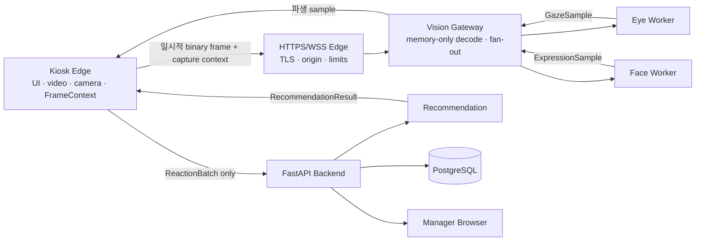

# ADR-0001 원격 Eye·Face 추론 서버 전환

- 상태: Proposed
- 작성일: 2026-08-13
- 결정 소유자: 박형진
- 공동 리뷰: 양유상(Eye), 정은미(Face), 조윤혜(Kiosk)
- 관련 결정: `D1-05 Eye·Face 모델 실행 위치`
- 후속 추천 결정: [`ADR-0006 중앙 판단 추천 AI와 파생 evidence 수명`](0006-central-recommendation-ai.md)
- 대체 조건: 이 ADR이 Accepted가 되면 기존 Kiosk-local 1차 기본안을 대체한다.

## 1. 문제

Eye Tracking과 표정 분석 모델을 Kiosk 기기에서 함께 실행하면 모델 의존성, CPU/GPU·RAM, 설치 재현성과 장시간 안정성 때문에 실제 시연 환경을 만족하기 어렵다고 판단했다. Kiosk는 터치 UI, 룩북 재생, 카메라 캡처와 시간 동기화에 집중하고 무거운 Python 추론은 별도 서버에서 실행하는 방향을 검토한다.

이 변경은 단순한 배포 위치 변경이 아니다. 기존 D1-05는 원본 프레임을 Kiosk 밖으로 보내지 않는 것을 고정 원칙으로 두었으므로 다음 항목을 함께 바꿔야 한다.

- 원본 프레임의 네트워크 전송에 대한 명시적 고객 동의
- Kiosk와 추론 서버 사이의 실시간 전송 계약
- 원본 프레임 비저장·비로그 보장과 접근 통제
- 네트워크 지연·단절·서버 과부하 시 실패 의미
- 실제 서버 환경에서의 Eye·Face 모델 benchmark

## 2. 제안 결정

### 실행 위치

| 위치 | 실행 책임 |
| --- | --- |
| Kiosk의 Edge 브라우저 | S01-S04, 고객 동의, 단일 `FrameSource`, 캡처 시각·`video_time_ms`·layout 생성, 전송량 제어, 결과 표시 |
| HTTPS/WSS Edge | TLS 종료, 허용 origin 확인, WebSocket upgrade, 연결·크기 제한. 프레임 본문은 기록하지 않음 |
| Vision Inference Gateway | 세션 인증, frame envelope 검증, 메모리 decode, Eye·Face fan-out, timeout·drop·결과 결합 |
| Eye Worker | 보정 상태와 선택 Eye Adapter를 이용해 `GazeSample` 생성 |
| Face Worker | 선택 Face Adapter를 이용해 `ExpressionSample` 생성 |
| FastAPI Backend | 세션, 동의 version, 파생 신호의 세션 메모리 집계, 추천, 상품·QR와 명시적 Manager event 관리 |
| PostgreSQL | 상품 catalog, 최소 최종 추천과 운영 metadata만 저장. 원본 프레임·embedding·frame 단위 파생 timeline은 저장하지 않음 |

Vision Gateway는 일반 FastAPI Backend와 논리적으로 분리한다. 같은 서버에 배포할 수는 있지만 원본 프레임이 REST middleware, DB 처리, request body log 또는 일반 오류 추적 경로를 지나지 않게 별도 process/container와 route를 사용한다. 외부에는 `443`만 노출하고 Worker와 PostgreSQL 포트는 공개하지 않는다.

### 목표 구조



### Kiosk-facing 경계

Frontend는 추론 위치를 직접 다루지 않고 기존 `VisionClient` 의미를 유지한다.

```text
startSession(context)
startCalibration(pattern)
startInference()
onGazeSample(sample)
onExpressionSample(sample)
stopSession()
health()
```

`RemoteVisionClient`가 WSS 연결, 인코딩, flow control, 재연결과 서버 결과를 위 callback으로 변환한다. Fake·Replay 구현은 네트워크나 실제 모델 없이 계속 사용할 수 있어야 한다.

### 전송 방식

MVP는 동일 origin의 `wss://.../vision/v1/stream`에서 binary WebSocket을 사용한다.

- 텍스트 JSON에 base64 이미지를 넣지 않는다.
- 한 logical frame은 protocol version, `frame_id`, `sequence`, `captured_at_mono_ms`, `video_time_ms`, `playback_epoch`, viewport·video layout, 인코딩 정보와 binary image를 함께 전달한다.
- 서버 결과는 입력 `frame_id`와 캡처 시점 context를 그대로 보존한다.
- 표준 WebSocket에는 자동 backpressure가 없으므로 기본값은 세션당 in-flight frame `1`이다. 결과 또는 명시적 drop 응답 뒤 다음 frame을 보낸다.
- 새 frame이 생겼는데 이전 frame이 대기 중이면 오래된 미전송 frame을 폐기한다. 영상 재생을 추론 때문에 멈추지 않는다.
- `bufferedAmount`, 최대 message bytes, decode timeout, inference deadline과 세션별 FPS limit을 둔다.
- 해상도, 인코딩 품질, sampling FPS와 deadline 수치는 실제 서버에서 Eye·Face 품질과 capture-to-result p50/p95를 함께 측정한 뒤 확정한다.

WebRTC는 네트워크 적응과 media streaming에는 강하지만 frame별 Kiosk metadata 결합, signaling과 운영 복잡도가 커 MVP에서는 선택하지 않는다. 다중 Kiosk 또는 WSS 대역폭·지연이 Gate를 통과하지 못할 때 재평가한다.

## 3. 개인정보·보안 불변조건

이 ADR이 Accepted되기 전에는 실제 고객 프레임의 원격 전송을 구현하거나 운영하지 않는다. 승인 후에도 다음 조건을 모두 지킨다.

1. S02에서 `카메라 사용`, `원격 추론 서버로 일시 전송`, `저장하지 않음`, `파생 신호 저장 목적`을 구분해 안내하고 동의한 세션에서만 연결한다.
2. 카메라는 video만 요청하며 audio capture·전송은 사용하지 않는다.
3. Kiosk 페이지와 stream은 HTTPS/WSS만 사용하고 허용 origin을 정확히 allowlist한다.
4. 세션 생성 후 짧은 수명의 stream 권한을 발급한다. bearer token을 URL query에 넣지 않고 Secure·HttpOnly·SameSite cookie 또는 검토된 WebSocket subprotocol 방식을 사용한다.
5. 세션·동의 상태와 Kiosk ID를 handshake에서 검증하고 세션 종료·동의 철회·만료 시 연결을 닫는다.
6. reverse proxy buffering, request/response body logging, frame dump, APM payload capture, debug snapshot와 crash dump를 비활성화한다.
7. Gateway와 Worker는 frame을 메모리에서만 처리하고 결과·timeout·연결 종료 뒤 참조를 즉시 해제한다. 파일, object storage, DB, message queue, cache와 backup에 쓰지 않는다.
8. 로그에는 frame, 얼굴 image, embedding, token과 원문 session ID를 넣지 않는다. 연결 시작·종료, 익명화한 상관 ID, 지연, drop 수, 오류 code와 자원 사용량만 기록한다.
9. message 크기, 연결 수, FPS, idle time과 inference queue에 상한을 두고 잘못된 payload는 decode 전에 거부한다.
10. Worker 포트와 PostgreSQL은 private network에만 두며 server shell·운영 dashboard 접근자를 최소화한다.
11. 실제 고객 얼굴 영상은 test fixture, benchmark artifact 또는 CI artifact로 남기지 않는다. 테스트 frame은 실행 중 합성해 사용한다.

## 4. Contract 영향

이 ADR은 Vision 생산자·transport 경계를 다룬다. 파생 sample을 중앙 추천 evidence로 결합하는 방식, 추천 weight·출력과 보유 수명은 [`ADR-0006`](0006-central-recommendation-ai.md)이 우선한다. 특히 frame 단위 파생값은 추천 세션 메모리에서만 사용한 뒤 폐기하며 PostgreSQL에 영속화하지 않는다.

기존 JSON Contract v1의 `GazeSample`, `ExpressionSample`, `ProductAttentionEvent`, `ReactionBatch`와 `RecommendationResult` 의미는 바꾸지 않는다. Contract v1과 일반 REST API에는 계속 원본 frame, image bytes, base64, embedding과 원본 경로를 넣지 않는다.

원격 추론을 승인하면 구현 전에 별도 공유 Contract PR로 다음을 정의한다.

- `Vision Stream v1`: handshake, control message, binary frame envelope, result, drop/error와 close 의미
- 세션별 stream 권한 발급·만료 방식
- protocol version negotiation과 최대 message size
- `frame_id`·capture context 보존, 중복·지연·순서 역전 규칙
- `vision_unavailable`, `network_unavailable`, `inference_timeout`, `server_overloaded` 실패 매핑

Binary transport는 파생 event Contract v1과 분리한다. schema fixture에는 실제 image payload를 커밋하지 않고 metadata와 실행 중 생성하는 synthetic frame으로 검증한다.

## 5. 장애와 fallback

| 상황 | Kiosk 동작 | 데이터 의미 |
| --- | --- | --- |
| 동의하지 않음 | 카메라·stream을 열지 않고 비-AI 탐색 흐름 제공 | 분석 session을 생성하지 않거나 명시적 미동의 상태 |
| 카메라 권한 거부 | S03 진입 중단, 권한 안내와 이전 화면 제공 | 중립·무관심으로 대체하지 않음 |
| 서버 연결 실패 | 제한된 횟수만 재시도하고 camera·buffer 해제 | `network_unavailable` |
| 지연·과부하 | 오래된 frame drop, 영상은 계속 재생 | drop metric 기록, 가짜 sample 생성 금지 |
| Eye 또는 Face 일부 실패 | 성공한 신호만 전달하고 실패 신호는 `valid=false` | `reason` 보존 |
| 유효 신호 부족 | S04에서 분석 불가/다시 시도 안내 | `RecommendationResult.status=insufficient_data` |
| 세션 종료 | stream close, 서버 queue·보정 상태 만료 | 남은 파생 batch만 flush |

네트워크 장애 때 실제 추론 결과 대신 Fake Adapter 결과를 고객에게 보여주지 않는다. Fake·Replay는 개발·CI·명시된 데모 모드에서만 사용한다.

## 6. 배포 기본안과 용량 Gate

첫 배포는 한 대의 Linux server에 다음 container를 두는 작은 구성을 기준으로 한다.

- TLS reverse proxy
- `vision-gateway`
- Eye·Face worker 또는 dependency가 호환될 때 하나의 worker runtime
- 기존 FastAPI Backend
- PostgreSQL

GPU 종류와 cloud 상품은 모델이 정해지기 전에 확정하지 않는다. [`Vision 추론 서버 선정·비용 결정 계획`](../benchmarks/VISION_SERVER_SELECTION_PLAN.md)에 따라 D5 benchmark에서 workload·모델을 먼저 고정하고 CPU/GPU별 모델 메모리, warmup, 한 세션 capture-to-result p50/p95, 지속 FPS와 10분 이상 안정성을 기록한 뒤 가장 작은 통과 사양을 선택한다. 첫 용량 Gate는 동시 Kiosk `1`대로 검증하고 실제 동시 사용 요구가 확인되면 `N`개 세션 load test로 확장한다. 같은 날짜·region·과금 조건의 총비용과 운영·보안 Gate까지 통과한 결과만 후속 ADR-0002에서 cloud·region·instance 결정으로 승인한다.

## 7. 구현 순서

Contract 변경 순서를 지키며 다음 PR을 직렬로 진행한다.

1. **Decision PR**: 이 ADR, D1-05, 전체 설계, 상세 계획과 영역 README를 합의한다.
2. **Transport Contract PR**: Vision Stream v1과 session stream 권한, synthetic protocol test를 추가한다.
3. **Gateway PR**: FakeEye/FakeFace를 사용하는 WSS Gateway, 인증·origin·limit·비저장 test를 구현한다.
4. **Kiosk Producer PR**: `RemoteVisionClient`, binary encoder, in-flight `1`, frame drop과 disconnect UI를 구현한다.
5. **Model·Server Benchmark Gate**: 고정 후보와 합성 fixture를 CPU → fractional GPU → full GPU 순서로 비교하고, network·동시 세션·총비용·보안 Gate를 통과한 cloud·region·instance를 ADR-0002로 승인한다.
6. **Eye Worker PR**: 선택 Eye Adapter와 보정 state를 승인된 서버 runtime에 연결한다.
7. **Face Worker PR**: 선택 Face Adapter와 taxonomy 정규화를 승인된 서버 runtime에 연결한다.
8. **Wiring PR**: 파생 sample callback → AOI/ReactionBatch → Backend를 연결한다.
9. **Deployment PR**: ADR-0002의 승인된 사양에 TLS, private network, secret, health/readiness, resource limit과 rollback을 구성한다.
10. **Live Gate**: 한 세션 전체 룩북, 네트워크 단절, 과부하, 세션 reset과 원본 frame 비저장을 검증한다.

## 8. 승인 Gate

다음 항목이 모두 확인되어야 상태를 `Accepted`로 바꾼다.

- [ ] 팀이 원격 원본 프레임 전송 필요성과 고객 동의 문구를 승인했다.
- [ ] 서버 운영 주체·region·접근자·삭제·로그 정책을 기록했다.
- [ ] 예상 동시 Kiosk 수와 현장 network 조건을 기록했다.
- [ ] WSS synthetic vertical slice에서 frame/context와 결과가 정확히 대응한다.
- [ ] 선택 Eye·Face 모델이 같은 서버 조건의 benchmark를 통과했다.
- [ ] capture-to-result 지연·지속 FPS·drop rate의 합격 수치를 팀이 확정했다.
- [ ] 서버 선정 계획의 CPU→GPU·network·동시 세션·총비용·운영 Gate를 통과하고 ADR-0002를 승인했다.
- [ ] 원본 frame이 proxy·app·APM·DB·cache·artifact·backup에 남지 않음을 점검했다.
- [ ] 연결 실패 시 가짜 분석을 만들지 않고 `insufficient_data` 흐름으로 종료된다.
- [ ] 배포 비용과 시연 시간 동안의 운영 방법·rollback 담당자를 확정했다.

## 9. 아직 확정하지 않는 값

- Eye·Face 최종 모델과 revision
- cloud 사업자, instance/GPU 종류와 비용
- frame 해상도, encoding, sampling FPS와 deadline
- Gateway와 두 Worker 사이의 process/container/IPC 방식
- 동시 접속 수와 autoscaling 여부
- 최소 최종 추천 metadata의 보유 기간과 정확한 동의 문구

## 10. 참고

- [MDN `getUserMedia()`](https://developer.mozilla.org/en-US/docs/Web/API/MediaDevices/getUserMedia): 카메라는 secure context와 사용자 권한이 필요하다.
- [MDN WebSocket API](https://developer.mozilla.org/en-US/docs/Web/API/WebSockets_API): 표준 `WebSocket`은 자동 backpressure를 제공하지 않는다.
- [Starlette WebSockets](https://www.starlette.io/websockets/): text·bytes message와 연결 종료 처리를 지원한다.
- [NGINX WebSocket proxying](https://nginx.org/en/docs/http/websocket.html): reverse proxy의 upgrade header와 timeout을 명시적으로 구성해야 한다.
- [OWASP WebSocket Security Cheat Sheet](https://cheatsheetseries.owasp.org/cheatsheets/WebSocket_Security_Cheat_Sheet.html): WSS, origin 검증, 인증, size/rate limit과 민감 payload 비로그 원칙을 참고한다.
