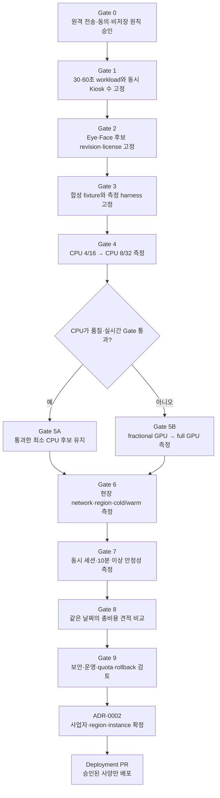

# Vision 추론 서버 선정·비용 결정 계획

- 상태: Proposed
- 작성일: 2026-08-13
- 결정 시점: D5 외부 모델 선택 Gate
- 결정 소유자: 박형진
- 공동 검증: 양유상(Eye), 정은미(Face), 조윤혜(Kiosk)
- 관련 결정: [`ADR-0001 원격 Eye·Face 추론 서버 전환`](../adr/0001-remote-vision-inference.md)

## 1. 목적

Eye Tracking과 표정 분석을 실행할 cloud·region·instance를 가격만으로 먼저 고르지 않는다. 30초·60초 룩북 세션의 실제 workload, 선택 모델의 품질·지연·메모리, 현장 network와 동시 Kiosk 수를 같은 조건에서 측정한 뒤 **모든 Hard Gate를 통과한 가장 작은 구성**을 선택한다.

이 문서는 서버 선정 순서와 증거 형식을 정의한다. AWS, Google Cloud 또는 특정 instance를 최종 선택하지 않으며, 실제 배포 완료를 뜻하지 않는다. 최종 결정은 benchmark 결과를 근거로 후속 `ADR-0002 Vision 서버 사업자·region·instance 선정`에 기록한다.

## 2. 결정 원칙

1. 모델의 URL·revision·license·checksum을 고정하기 전에 cloud를 확정하지 않는다.
2. 실제 고객 frame이 아닌 합성 또는 승인된 비식별 fixture로 먼저 비교한다.
3. Eye·Face 후보는 같은 입력, 순서, FPS, server 사양과 반복 수에서 비교한다.
4. 품질·개인정보·실시간성·안정성 Hard Gate를 하나라도 통과하지 못한 후보는 낮은 가격으로 되살리지 않는다.
5. CPU부터 시험하고, 실패 근거가 있을 때 fractional GPU와 full GPU로 확장한다.
6. 첫 용량 Gate는 동시 Kiosk `1`대다. 실제 요구가 확정되면 같은 구성에서 `N`개 동시 세션을 다시 측정한다.
7. 가격은 결정 당일의 같은 통화·region·과금 방식으로 다시 조회한다. 무료 credit과 일회성 promotion은 기본 비용과 분리한다.
8. 최종 선택 전에는 운영용 고객 frame 전송, 장기 약정, Reserved/Committed 계약과 production 배포를 하지 않는다.

## 3. 전체 결정 순서



앞 Gate의 증거가 없으면 다음 Gate로 넘어가지 않는다. 중간 결과가 불충분하면 `TBD`와 재측정 담당자를 남기며, 추정값을 확정값으로 바꾸지 않는다.

## 4. Gate 0 — 개인정보·운영 전제 승인

다음 항목이 승인되기 전에는 실제 고객 frame으로 원격 benchmark를 하지 않는다.

- 원격 서버로의 일시적 frame 전송 필요성
- 카메라 사용, 원격 전송, 비저장과 파생 신호 저장 목적을 구분한 동의
- 운영 주체, 접근자, 허용 region과 데이터 처리 위치
- proxy·Gateway·Worker·APM·로그·cache·artifact·backup의 원본 frame 비저장
- session 종료·동의 철회·만료 시 연결과 메모리 참조 해제

승인 전 benchmark는 실행 중 생성한 합성 frame 또는 별도 승인을 받은 비식별 fixture만 사용한다.

## 5. Gate 1 — workload 고정

### 공통 입력 조건

| 항목 | 1차 비교값 | 확정 방법 |
| --- | --- | --- |
| 룩북 길이 | 30초, 60초 모두 | 최종 S03 영상 version 확정 후 재검증 |
| 카메라 요청값 | 1280×720 | 실제 Kiosk 협상 결과를 실행 로그에 기록 |
| sampling FPS | 5, 10, 15 | Eye 품질과 capture-to-result를 함께 비교 |
| Eye 실행 빈도 | 수신 sampling frame마다 | 후보별 지원 범위와 품질 측정 |
| Face 실행 빈도 | 같은 frame에서 3~5 FPS로 subsampling 후보 | score 안정성과 자원 감소량 비교 |
| 동시 세션 | `N=1` 우선 | 시연·운영 예상 Kiosk 수 확정 후 `N` 확장 |
| 영상 재생 | 추론 때문에 정지하지 않음 | 오래된 미전송 frame drop |

서버는 룩북 영상 파일을 분석하는 것이 아니라 고객이 룩북을 보는 동안 sampling한 웹캠 frame을 처리한다. 예상 frame 수는 다음 식으로 계산한다.

```text
frame_count = session_seconds × sampling_fps
upload_bytes = frame_count × measured_encoded_frame_bytes
frame_interval_ms = 1000 ÷ sampling_fps
```

| Sampling | 30초 | 60초 | 다음 frame까지의 시간 |
| --- | ---: | ---: | ---: |
| 5 FPS | 150 | 300 | 200 ms |
| 10 FPS | 300 | 600 | 100 ms |
| 15 FPS | 450 | 900 | 약 66.7 ms |

인코딩 크기와 전송량은 추정치 대신 실제 Kiosk encoder의 p50/p95 bytes로 기록한다.

## 6. Gate 2 — 모델 후보 고정

Eye는 [`D2 Eye Tracker 전수 조사·추천 계획`](EYE_CANDIDATE_RESEARCH_PLAN.md)의 전수 inventory·Hard Gate·Smoke·점수화를 거친 D4 상위 최대 3개를 사용한다. Face는 최소 3개 후보를 inventory한다. 그 뒤 다음 Hard Gate를 적용한다.

- 공식 source URL 또는 Hugging Face model ID
- 정확한 commit SHA 또는 revision
- code license와 weight license
- weight checksum과 다운로드 위치
- Python·CUDA·ONNX Runtime 등 실행 의존성
- 입력 크기, 출력 좌표·label 의미와 no-face/invalid 처리
- offline 실행 가능 여부와 외부 전송 여부
- CPU/GPU 지원, model·runtime memory와 예상 warmup

revision·license·checksum·출력 의미를 고정할 수 없는 후보는 서버 비교 대상에서 제외하거나 `Deferred`로 남긴다.

## 7. Gate 3 — 동일 benchmark package 고정

모든 server 후보는 다음 입력과 명령을 공유한다.

- version이 고정된 합성·비식별 30초와 60초 fixture
- 동일 frame 순서, 5/10/15 FPS와 동일 encoding 설정
- 동일 Eye calibration fixture와 Face taxonomy mapping
- cold start와 warm run을 분리한 반복 실행
- model weight와 container image digest 고정
- 실행 날짜, OS image, driver, CUDA/runtime와 설치 명령 기록
- 원본 frame을 남기지 않는 metrics-only collector

결과 보고서는 `docs/benchmarks/vision-server/<YYYY-MM-DD>-<candidate-id>.md` 형식을 사용한다. 실제 frame, image bytes, base64, embedding, credential, token과 원본 경로는 보고서·로그·CI artifact에 넣지 않는다.

## 8. Gate 4·5 — 최소 사양 탐색

### 시험 순서

| 순서 | 비교 등급 | 1차 기준 | 다음 단계 조건 |
| ---: | --- | --- | --- |
| 1 | CPU Small | 4 vCPU, RAM 16 GiB | 품질·실시간·안정성 통과 시 유지 |
| 2 | CPU Medium | 8 vCPU, RAM 32 GiB | CPU Small 실패 원인이 CPU·RAM일 때만 |
| 3 | Fractional GPU | 4 vCPU, RAM 16 GiB, VRAM 약 3 GiB부터 | model·runtime이 VRAM에 들어가고 CPU가 실패했을 때 |
| 4 | Full GPU | 4 vCPU, RAM 16 GiB, L4급 1개 | fractional GPU가 VRAM·성능 Gate를 못 맞출 때 |

2026-08-13 기준 비교 가능한 예시는 AWS `g6f.xlarge`의 1/8 L4·VRAM 3GB·4 vCPU·16 GiB, AWS `g6.xlarge`와 Google Compute Engine `g2-standard-4`의 full L4급 구성이다. 이는 후보 inventory이며 최종 선택이 아니다. 제품 사양·region·quota는 실행 직전에 공식 문서와 console에서 다시 확인한다.

### 기록할 성능·품질

- 전체 capture-to-result p50/p95, server inference p50/p95와 첫 결과 시간
- Eye AOI hit·target 오차·valid 비율·jitter와 calibration 결과
- Face label mapping, 정답 label이 있을 때 macro-F1·class recall, score 안정성
- 지속 result FPS, frame drop·timeout·reconnect 수
- CPU/GPU utilization, RAM/VRAM peak, model load와 warmup 시간
- 30초·60초 반복과 10분 이상 연속 실행의 memory 증가·crash·OOM

정답 label이 없는 영상 결과는 품질 정확도가 아니라 `안정성 관찰`로 표시한다.

## 9. Gate 6 — network와 region

1. 개인정보·운영 승인을 받은 region만 후보로 둔다.
2. 한국 매장 기준으로 서울 region을 먼저 시험한다.
3. 서울에 필요한 상품이 없으면 가장 가까운 승인 가능한 region을 후보로 두고 국외 전송 여부를 다시 검토한다.
4. 실제 Kiosk network에서 같은 시간대에 cold/warm 각각 3회 이상 측정한다.
5. RTT·jitter·packet loss, WSS 연결·재연결, encode·upload·decode를 포함한 capture-to-result를 기록한다.
6. 서버 성능이 좋아도 network 포함 p95와 drop Gate를 통과하지 못하면 제외한다.

2026-08-13 공식 문서 기준으로 AWS Seoul은 G6·G6f를 제공하고 Google Compute Engine Seoul zone은 G2를 제공한다. Google Cloud Run L4 GPU 지원 region 목록에는 Seoul이 없고 APAC 후보는 Singapore다. 이 가용성은 변경될 수 있으므로 Gate 실행일에 다시 조회한다.

## 10. Gate 7 — 동시 세션과 안정성

먼저 `N=1`로 한 세션을 통과시킨 뒤 실제 예상 동시 Kiosk 수로 확장한다.

```text
N = 1 → 2 → 실제 요구 N
```

각 단계에서 다음을 확인한다.

- session별 in-flight frame `1`과 latest-frame-first가 유지되는가
- Eye·Face fan-out이 서로를 무한 대기시키지 않는가
- p95·drop·timeout이 합격 범위를 유지하는가
- session 간 calibration·frame_id·결과가 섞이지 않는가
- max connection, queue, message bytes, FPS와 GPU quota가 명시되는가
- 과부하 시 `server_overloaded`를 반환하고 Fake 결과를 만들지 않는가

한 instance의 통과 가능한 최대 동시 세션 수를 측정하기 전에는 `Kiosk 수 = instance 수`로 비용을 단순 곱하지 않는다.

## 11. Gate 8 — 같은 조건의 비용 견적

### 비용식

```text
session_compute_cost
  = billable_instance_seconds × hourly_compute_rate ÷ 3600
    ÷ stable_concurrent_sessions_per_instance

event_cost
  = warm_instance_hours × hourly_compute_rate
    + storage + public IPv4/load balancer + registry
    + network + monitoring/logging + database + tax

monthly_cost
  = active_instance_hours × hourly_compute_rate
    + idle/min-instance cost + shared infrastructure cost
```

같은 날짜에 다음 세 가지 견적을 만든다.

1. 30초·60초 고립 세션 1회의 최소 청구와 cold start 포함 비용
2. 해커톤·시연 시간 동안 warm instance를 유지하는 비용
3. 월간 예상 session 수와 동시 Kiosk 수를 반영한 운영 비용

### 2026-08-13 참고 스냅샷

아래 값은 계산 절차를 검증하기 위한 참고값이며 가격 결정 증거가 아니다. 할인·무료 tier·VAT·network·storage를 제외했고, 최종 Gate에서 공식 calculator 결과를 다시 첨부한다.

| 후보 | 참고 사양·과금 | 단순 계산 | 확인할 제약 |
| --- | --- | --- | --- |
| Google Cloud Run CPU | 4 vCPU·16 GiB, instance-based 기본 단가 | 약 `$0.3744/h`, 최소 1분 약 `$0.00624`, 6시간 약 `$2.25` | Seoul 가능 여부, WebSocket active billing, cold/model load |
| Google Cloud Run GPU | 4 vCPU·16 GiB + L4, non-zonal 기본 단가 | 약 `$1.04652/h`, 최소 1분 약 `$0.017442`, 6시간 약 `$6.28` | 현재 L4 Seoul 미지원, Singapore RTT·국외 전송 검토 |
| Google Compute Engine G2 | `g2-standard-4`, 4 vCPU·16 GiB + L4 | 공식 가격표 기본 표시 약 `$0.706832276/h` | Seoul 실제 단가·zone quota·disk/IP를 calculator에서 재조회 |
| AWS EC2 G6f/G6 | fractional 또는 full L4 | `TBD` — 결정일 Seoul On-Demand calculator 결과 사용 | instance별 VRAM, quota, EBS/IP, start/stop 시간 |

Cloud Run 계산은 공식 기본 단가 `CPU $0.000018/vCPU-second`, `Memory $0.000002/GiB-second`, non-zonal `L4 $0.0001867/second`를 사용했다. WebSocket 연결이 열려 있으면 instance가 active로 간주되며, instance-based billing은 instance 수명당 최소 1분이 청구된다. 실제 model load가 1분 경계를 넘는지도 측정한다.

Spot·preemptible 가격은 benchmark 비용 참고에는 사용할 수 있지만 중단 가능한 live 시연의 기본안으로 선택하지 않는다. 장기 약정 할인은 실제 운영량이 확정되기 전 의사결정 점수에 넣지 않는다.

## 12. Gate 9 — 보안·운영 Hard Gate

가격 비교에 남으려면 다음 항목을 모두 충족해야 한다.

- HTTPS/WSS와 허용 origin, 짧은 수명의 stream 권한
- frame body logging·proxy buffering·APM payload capture·debug dump 비활성화
- worker·DB private network, 외부에는 `443`만 노출
- health/readiness, model warmup, graceful close와 resource limit
- 계정·IAM 최소 권한, secret manager와 운영 접근자 기록
- quota 승인, instance 재시작·capacity 부족·region 장애 대응
- 자동 종료 또는 scale-to-zero, 시연 전 warmup, 비용 budget·alert
- 배포 image digest, model revision·checksum과 rollback image 고정

무료 credit이 있어도 위 조건을 충족하지 못하면 선택하지 않는다.

## 13. 최종 선택 규칙

모든 Hard Gate를 통과한 후보만 다음 순서로 결정한다.

1. CPU Small이 통과하면 더 큰 CPU·GPU 후보보다 우선한다.
2. CPU가 실패하면 통과한 가장 작은 fractional GPU를 우선 비교한다.
3. full GPU가 필요하면 같은 region·동일 L4급·동일 운영 시간으로 AWS와 Google Compute Engine을 비교한다.
4. scale-to-zero가 유리하더라도 cold/model load 또는 region·개인정보 Gate를 실패하면 제외한다.
5. 통과 후보가 여러 개면 예상 운영 기간의 **총비용**이 가장 낮고 팀이 운영 가능한 구성을 선택한다.
6. 가격 차이가 작으면 현장 network p95, 배포 재현성, quota 안정성과 rollback 단순성을 우선한다.

최종 `ADR-0002`에는 다음을 남긴다.

- 선택한 cloud, region·zone, 상품·instance와 CPU/RAM/GPU/VRAM
- 선택한 Eye·Face revision, license와 checksum
- 30초·60초, FPS, 동시 세션별 benchmark 링크
- capture-to-result·drop·자원·안정성 합격 결과
- 시간당·세션당·시연·월간 비용과 계산 날짜
- warm/min instance·autoscaling·최대 동시 세션 정책
- 개인정보·로그·접근·삭제·region 결정
- 제외한 대안과 제외 근거
- 배포·비용 alert·rollback 담당자

`ADR-0002`가 `Accepted`되기 전에는 Deployment PR을 병합하지 않는다.

## 14. 역할과 산출물

| 담당 | 책임 | D5 산출물 |
| --- | --- | --- |
| 박형진 | 공통 harness, server·network·비용, 보안·운영 Gate, 최종 ADR | server 비교표, calculator capture, ADR-0002 |
| 양유상 | D2 Eye 전수 조사·1차 추천, D4 상위 최대 3개의 보정·AOI 품질과 지연·자원 | Eye 후보별 동일 조건 보고서와 선택 근거 |
| 정은미 | Face 후보·taxonomy·품질과 지연·자원 | Face 후보별 동일 조건 보고서와 선택 근거 |
| 조윤혜 | Kiosk encoder, FPS, WSS·network와 오류 UX | 실제 전송량·capture-to-result·disconnect 관찰 |

## 15. 완료 조건

- [ ] 원격 전송·동의·비저장과 허용 region이 승인되었다.
- [ ] 30초·60초와 5/10/15 FPS workload가 같은 fixture로 재현된다.
- [ ] Eye·Face 후보의 revision·license·checksum과 출력 의미가 고정되었다.
- [ ] CPU Small부터 필요한 GPU 단계까지 같은 harness로 측정했다.
- [ ] 품질, p50/p95, FPS, drop, CPU/GPU/RAM/VRAM과 10분 안정성을 기록했다.
- [ ] 실제 Kiosk network와 예상 동시 세션 수를 측정했다.
- [ ] 같은 날짜·region·과금 조건으로 세션·시연·월간 총비용을 비교했다.
- [ ] 원본 frame 비저장과 보안·운영 Hard Gate를 점검했다.
- [ ] ADR-0002가 선택·제외 근거, 비용, 운영·rollback 담당자를 포함해 승인되었다.
- [ ] 승인된 사양으로만 Deployment PR을 시작했다.

## 16. 공식 참고 자료

- [Google Cloud Run pricing](https://cloud.google.com/run/pricing)
- [Google Cloud Run GPU 지원 사양·region](https://docs.cloud.google.com/run/docs/configuring/services/gpu)
- [Google Cloud Run WebSocket과 과금](https://docs.cloud.google.com/run/docs/triggering/websockets)
- [Google Compute Engine accelerator-optimized 가격](https://cloud.google.com/products/compute/pricing/accelerator-optimized)
- [Google Compute Engine GPU region·zone](https://docs.cloud.google.com/compute/docs/regions-zones/gpu-regions-zones)
- [AWS EC2 G6·G6f 사양](https://aws.amazon.com/ec2/instance-types/g6/)
- [AWS EC2 region별 instance 가용성](https://docs.aws.amazon.com/ec2/latest/instancetypes/ec2-instance-regions.html)
- [AWS EC2 On-Demand pricing](https://aws.amazon.com/ec2/pricing/on-demand/)
- [AWS Pricing Calculator](https://calculator.aws/)
